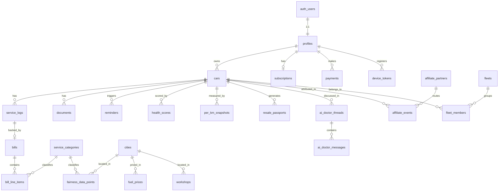

# Odo — Database Schema

> Engineering companion to the Odo PRD v1.0. This document is the source of truth for the database layer.

|  |  |
| --- | --- |
| **Version** | v1.0 |
| **Date** | June 2026 |
| **Status** | Draft — For Review |
| **Database** | PostgreSQL 15 (Supabase) |
| **Auth** | Supabase Auth (`auth.users`) |
| **Storage** | Supabase Storage (S3-compatible buckets) |
| **Owner** | Founder / Engineering |
| **Related docs** | Odo PRD v1.0, Technical Design Doc (TDD) |

---

## 1. Purpose & Scope

This document defines the complete persistence layer for Odo: every table, relationship, constraint, index, Row-Level Security (RLS) policy, storage bucket, and the helper functions/triggers/views that the application depends on.

It is written to be **migration-ready** — the DDL in Section 9 can be split into ordered migration files and applied as-is. Tables are tagged by rollout phase (MVP / Phase 2 / Phase 3) but the schema is designed up-front so that later phases require *additive* migrations only, never destructive rewrites.

What this doc deliberately does **not** cover: API request/response contracts, AI prompt specs, and client-side caching/offline strategy. Those live in the TDD and the AI Behaviour Spec.

---

## 2. Design Principles & Conventions

These conventions are applied uniformly across every table. They exist to keep the schema predictable and to make RLS cheap.

**2.1 Identifiers**

- Every table uses `id uuid PRIMARY KEY DEFAULT gen_random_uuid()`.
- *Rationale:* UUIDs are generatable client-side (useful for optimistic/offline inserts), non-enumerable (a leaked sequential int would let anyone guess `/passport/124`), and merge cleanly across the offline-first sync layer. The write-amplification cost of random UUIDs is irrelevant at Odo's scale.

**2.2 Money is always integer paise**

- All monetary columns are `BIGINT` named `_paise` (e.g. `total_amount_paise`). Rupees = `paise / 100` in the UI layer only.
- *Rationale:* Never use `FLOAT`/`NUMERIC` arithmetic for money in application code paths. ₹2,800 is stored as `280000`. This eliminates an entire class of rounding bugs and keeps fairness-comparison math exact.

**2.3 Timestamps & soft deletes**

- Every table has `created_at timestamptz NOT NULL DEFAULT now()` and `updated_at timestamptz NOT NULL DEFAULT now()` (kept fresh by a trigger, Section 10).
- User-owned content tables carry `deleted_at timestamptz` (nullable). Rows are soft-deleted by stamping `deleted_at`; RLS and views filter them out. Hard deletes are reserved for GDPR/DPDP "delete my account" flows.

**2.4 Ownership denormalization for RLS**

- Every user-owned child table (service_logs, bills, documents, reminders, etc.) stores `owner_id uuid` directly, even though it is derivable by joining up to `cars`.
- *Rationale:* Supabase RLS runs a `USING` predicate per row. A flat `owner_id = auth.uid()` check is an index lookup; a multi-join subquery (`car_id IN (SELECT id FROM cars WHERE owner_id = auth.uid())`) runs on every row of every query and degrades badly. We pay a small denormalization cost (set `owner_id` on insert via trigger) to make the entire security layer fast and trivially auditable.

**2.4.1 owner_id integrity**

- `owner_id` is set by a `BEFORE INSERT` trigger that copies it from the parent `car`, so the client cannot spoof it and it can never drift from the car's true owner.

**2.5 Enumerations**

- Low-churn, code-coupled value sets (fuel type, document type, reminder status) use Postgres **native `ENUM` types** — they are compact and self-documenting.
- Value sets that may grow at runtime or need metadata (service categories, cities, partners) use **lookup tables** with FKs.
- *Rationale:* Native enums are great until you need to add a value under load (adding an enum value is fine; removing/reordering is painful). Anything a non-engineer might extend, or anything that needs extra columns, becomes a table.

**2.6 Naming**

- Tables: plural `snake_case` (`service_logs`). Columns: singular `snake_case`. Booleans: `is_*` / `has_*`. FKs: `<singular_referenced_table>_id`. Indexes: `idx_<table>_<cols>`. Constraints: `chk_*`, `uq_*`, `fk_*`.

**2.7 Schemas**

- Application tables live in `public`. Internal/reference data that must never be client-writable lives in `public` but with RLS that grants no write to `authenticated`. Auth lives in Supabase-managed `auth`.

---

## 3. Entity Catalog

| # | Table | Phase | Purpose | Owner-scoped? |
| --- | --- | --- | --- | --- |
| 1 | `profiles` | MVP | App-level user record, 1:1 with `auth.users` | self |
| 2 | `cars` | MVP | A vehicle owned/tracked by a user | yes |
| 3 | `service_logs` | MVP | One maintenance/expense event for a car | yes |
| 4 | `bills` | MVP | A scanned/uploaded bill + AI extraction result | yes |
| 5 | `bill_line_items` | MVP | Normalized line items extracted from a bill | yes |
| 6 | `documents` | MVP | Document vault (insurance, PUC, RC, etc.) | yes |
| 7 | `reminders` | MVP | Generated reminders (insurance, PUC, service) | yes |
| 8 | `health_scores` | MVP | Point-in-time AI health score snapshots | yes |
| 9 | `per_km_snapshots` | MVP | Cached per-km cost computations | yes |
| 10 | `device_tokens` | MVP | FCM push tokens per device | yes |
| 11 | `service_categories` | MVP | Canonical service taxonomy (lookup) | public-read |
| 12 | `cities` | MVP | City reference for fairness + fuel pricing | public-read |
| 13 | `fairness_data_points` | MVP | Anonymized crowdsourced price pool | de-identified |
| 14 | `fuel_prices` | MVP | Weekly city × fuel-type price | public-read |
| 15 | `subscriptions` | MVP | Current plan/tier per user | self-read |
| 16 | `payments` | MVP | Razorpay transactions (Pro, Passport) | self-read |
| 17 | `resale_passports` | Phase 2 | Generated shareable history report | yes + public-token |
| 18 | `ai_doctor_threads` | Phase 2 | AI Doctor conversation threads | yes |
| 19 | `ai_doctor_messages` | Phase 2 | Messages within a thread | yes |
| 20 | `affiliate_partners` | Phase 2 | Insurance/service/loan partners (lookup) | public-read |
| 21 | `affiliate_events` | Phase 2 | Click/lead/conversion tracking | yes |
| 22 | `fleets` | Phase 3 | A fleet grouping multiple cars | yes (owner) |
| 23 | `fleet_members` | Phase 3 | Car ↔ fleet membership | yes (owner) |
| 24 | `workshops` | Phase 3 | Workshop directory | public-read |

---

## 4. Entity-Relationship Diagram



> Note: `bill_line_items.service_category_id` is nullable — a handwritten or low-confidence scan may fail classification and still store a raw label.

---

## 5. Core Entity Specifications

### 5.1 `profiles`

Mirrors `auth.users` 1:1. Created automatically by a trigger on signup (Section 10.3). Holds app-level fields Supabase Auth doesn't.

Key fields: `id` (= `auth.users.id`), `full_name`, `phone` (E.164), `home_city_id` → `cities`, `preferred_language` (`hi` / `en` / `hinglish`), `onboarding_goal` (enum), `onboarding_completed_at`.

### 5.2 `cars`

The central aggregate root. Almost everything hangs off a car.

Key fields: `owner_id` → `profiles`, `make`, `model`, `variant`, `year`, `fuel_type` (enum), `registration_number` (nullable, stored uppercased + trimmed), `current_odometer_km`, `purchase_year`, `nickname`, `is_primary`. `current_odometer_km` is a **cached** denormalization of the latest service-log reading, refreshed by trigger (Section 10.4) — it powers home-screen and km-due reminders without an aggregate query.

### 5.3 `service_logs`

One maintenance or expense event. `odometer_km` is the only mandatory data field (PRD: minimize logging friction). `source` distinguishes `manual` vs `scanned`. `bill_id` is nullable (manual entries have no bill). `total_amount_paise` is the source of truth for cost analytics.

### 5.4 `bills`

The AI-scan record. Stores the storage path of the photo, the **raw** Claude Vision extraction as `extraction_json` (jsonb, for audit/debug/reprocessing), a `confidence` score, `extraction_status` (enum), and `is_handwritten` (handwritten → flagged for manual review, never auto-populated per PRD §5.2). A bill belongs to exactly one service log once confirmed.

### 5.5 `bill_line_items`

Normalized rows from the bill (e.g. "Oil change → ₹2,800"). Each carries `service_category_id` (nullable when unclassified), `amount_paise`, and a denormalized `fairness_snapshot` jsonb capturing what the comparison showed *at scan time* (city average, sample size, delta). Snapshotting is intentional: the shared pool changes daily, but the user must see a stable, reproducible "you overpaid ₹700" figure.

### 5.6 `documents`

The vault. `doc_type` enum (`insurance` / `puc` / `rc` / `loan` / `other`), `expiry_date` (drives reminders), `storage_path`. MVP caps free users at 3 documents — enforced in the application layer / via a count check, not a hard DB constraint (limits change with pricing experiments).

### 5.7 `reminders`

Generated, not user-authored. `reminder_type` enum maps to the PRD trigger table. `due_date`, `status` (`scheduled` / `sent` / `dismissed` / `actioned`), `channel` (`push` / `whatsapp` / `push_whatsapp`), `payload` jsonb (deep-link target, affiliate URL). A scheduler (Edge Function / cron) reads due rows and dispatches via FCM.

### 5.8 `health_scores`

Append-only **snapshots**, never updated in place. Each row stores total `score` plus the four PRD component scores (`maintenance_pts`, `documentation_pts`, `cost_efficiency_pts`, `history_pts`) and a `breakdown` jsonb of the per-rule detail. History is required for the "your score dropped to 68 — see what changed" reminder and for the Resale Passport timeline. The latest snapshot is read via a view (Section 11).

### 5.9 `fairness_data_points`

The crowdsourcing flywheel — and the schema's most privacy-sensitive table. It stores `service_category_id`, `city_id`, `amount_paise`, `car_make`, `fuel_type`, and `recorded_at`. It **deliberately has no `owner_id` / `car_id` / `bill_id`** — it is de-identified at write time so the pool can never be re-linked to an individual. Raw rows are not client-readable; aggregates are served only through a `SECURITY DEFINER` RPC (Section 12).

### 5.10 `resale_passports`

A generated, immutable report. Stores a `snapshot` jsonb (full car + score + verified timeline frozen at generation), a `share_token` (random, URL-safe), `pdf_storage_path`, `status`, and `expires_at`. Public, unauthenticated buyers read it via a security-definer RPC keyed on `share_token` — never via a broad RLS `SELECT` grant.

---

## 6. Enumerated Types

```sql
CREATE TYPE fuel_type        AS ENUM ('petrol', 'diesel', 'cng', 'electric');
CREATE TYPE log_source       AS ENUM ('manual', 'scanned');
CREATE TYPE scan_status      AS ENUM ('pending', 'processing', 'completed', 'failed', 'needs_review');
CREATE TYPE document_type    AS ENUM ('insurance', 'puc', 'rc', 'loan', 'other');
CREATE TYPE reminder_type    AS ENUM ('insurance_expiry', 'puc_expiry', 'service_due_km',
                                      'service_due_time', 'health_drop', 'inactivity');
CREATE TYPE reminder_status  AS ENUM ('scheduled', 'sent', 'dismissed', 'actioned', 'cancelled');
CREATE TYPE reminder_channel AS ENUM ('push', 'whatsapp', 'push_whatsapp');
CREATE TYPE onboarding_goal  AS ENUM ('sell_soon', 'track_costs', 'never_miss_renewal');
CREATE TYPE subscription_tier AS ENUM ('free', 'pro', 'fleet');
CREATE TYPE subscription_status AS ENUM ('active', 'past_due', 'cancelled', 'expired');
CREATE TYPE payment_status   AS ENUM ('created', 'authorized', 'captured', 'failed', 'refunded');
CREATE TYPE payment_kind     AS ENUM ('subscription', 'passport_unlock');
CREATE TYPE passport_status  AS ENUM ('generating', 'ready', 'expired', 'revoked');
CREATE TYPE affiliate_event_type AS ENUM ('impression', 'click', 'lead', 'conversion');
CREATE TYPE message_role     AS ENUM ('user', 'assistant', 'system');
```

---

## 7. Storage Buckets (Supabase Storage)

| Bucket | Public? | Contents | Path convention |
| --- | --- | --- | --- |
| `bill-photos` | private | Raw scanned bill images | `{owner_id}/{car_id}/{bill_id}.jpg` |
| `documents` | private | Insurance/PUC/RC scans | `{owner_id}/{car_id}/{document_id}.{ext}` |
| `passports` | private (signed URLs) | Generated passport PDFs | `{owner_id}/{passport_id}.pdf` |
| `avatars` | public | Optional profile photos | `{owner_id}.jpg` |

Storage objects are protected by Storage RLS policies keyed on the **first path segment = `auth.uid()`**, mirroring the path convention above. Passport PDFs are served to buyers via short-lived **signed URLs** generated by the share RPC — the bucket itself stays private so a leaked path is useless without a signature.

---

## 8. Referential Integrity & Delete Behaviour

| Relationship | On parent delete | Rationale |
| --- | --- | --- |
| `cars` → `profiles` | `CASCADE` | Deleting an account removes its cars and everything under them |
| `service_logs` → `cars` | `CASCADE` | A service log has no meaning without its car |
| `bills` → `service_logs` | `SET NULL` | A bill can exist briefly before its log is confirmed |
| `bill_line_items` → `bills` | `CASCADE` | Line items are owned by the bill |
| `bill_line_items` → `service_categories` | `SET NULL` + `RESTRICT` on category delete | Never orphan, never lose the row over taxonomy edits |
| `documents` → `cars` | `CASCADE` | — |
| `reminders` → `cars` | `CASCADE` | — |
| `health_scores` → `cars` | `CASCADE` | — |
| `resale_passports` → `cars` | `RESTRICT` | A sold/shared passport must survive even if the car is removed; revoke instead |
| `payments` → `profiles` | `RESTRICT` | Financial records are never auto-deleted; retained for compliance |
| `fairness_data_points` | (no FK to user) | De-identified; unaffected by account deletion |

> **Account-deletion (DPDP "right to erasure")** is therefore a deliberate, ordered procedure — not a single `DELETE` — because `payments` and `fairness_data_points` are intentionally retained (the latter is already anonymous). See Section 13.

---

## 9. DDL — Table Definitions

> Apply in the order shown. Extensions and enums (Sections above) come first, then lookups, then core tables.

### 9.0 Extensions

```sql
CREATE EXTENSION IF NOT EXISTS pgcrypto;   -- gen_random_uuid()
CREATE EXTENSION IF NOT EXISTS pg_trgm;    -- fuzzy search on make/model, workshops
```

### 9.1 Lookups (create first — they are FK targets)

```sql
CREATE TABLE cities (
    id          uuid PRIMARY KEY DEFAULT gen_random_uuid(),
    name        text NOT NULL,
    state       text NOT NULL,
    tier        smallint NOT NULL CHECK (tier IN (1, 2, 3)),
    is_active   boolean NOT NULL DEFAULT true,
    created_at  timestamptz NOT NULL DEFAULT now(),
    updated_at  timestamptz NOT NULL DEFAULT now(),
    CONSTRAINT uq_cities_name_state UNIQUE (name, state)
);

CREATE TABLE service_categories (
    id            uuid PRIMARY KEY DEFAULT gen_random_uuid(),
    slug          text NOT NULL UNIQUE,          -- 'oil_change', 'brake_pads', 'ac_service'
    display_name  text NOT NULL,
    -- which fuel types this service applies to; NULL = all
    applies_to    fuel_type[] NULL,
    is_active     boolean NOT NULL DEFAULT true,
    created_at    timestamptz NOT NULL DEFAULT now(),
    updated_at    timestamptz NOT NULL DEFAULT now()
);

CREATE TABLE affiliate_partners (              -- Phase 2
    id            uuid PRIMARY KEY DEFAULT gen_random_uuid(),
    slug          text NOT NULL UNIQUE,          -- 'acko', 'digit', 'gomechanic'
    display_name  text NOT NULL,
    category      text NOT NULL,                 -- 'insurance' | 'service' | 'loan'
    base_url      text NOT NULL,
    commission_note text,
    is_active     boolean NOT NULL DEFAULT true,
    created_at    timestamptz NOT NULL DEFAULT now(),
    updated_at    timestamptz NOT NULL DEFAULT now()
);
```

### 9.2 `profiles`

```sql
CREATE TABLE profiles (
    id                       uuid PRIMARY KEY REFERENCES auth.users (id) ON DELETE CASCADE,
    full_name                text,
    phone                    text,                       -- E.164, e.g. +919812345678
    home_city_id             uuid REFERENCES cities (id) ON DELETE SET NULL,
    preferred_language       text NOT NULL DEFAULT 'hinglish'
                               CHECK (preferred_language IN ('hi', 'en', 'hinglish')),
    onboarding_goal          onboarding_goal,
    onboarding_completed_at  timestamptz,
    created_at               timestamptz NOT NULL DEFAULT now(),
    updated_at               timestamptz NOT NULL DEFAULT now(),
    deleted_at               timestamptz,
    CONSTRAINT chk_profiles_phone CHECK (phone IS NULL OR phone ~ '^\+[1-9]\d{7,14}$')
);
```

### 9.3 `cars`

```sql
CREATE TABLE cars (
    id                   uuid PRIMARY KEY DEFAULT gen_random_uuid(),
    owner_id             uuid NOT NULL REFERENCES profiles (id) ON DELETE CASCADE,
    make                 text NOT NULL,
    model                text NOT NULL,
    variant              text,
    year                 smallint NOT NULL CHECK (year BETWEEN 1980 AND 2100),
    fuel_type            fuel_type NOT NULL,
    registration_number  text,                            -- uppercased, no spaces; nullable
    current_odometer_km  integer NOT NULL CHECK (current_odometer_km >= 0),
    purchase_year        smallint CHECK (purchase_year BETWEEN 1980 AND 2100),
    nickname             text,
    is_primary           boolean NOT NULL DEFAULT false,
    created_at           timestamptz NOT NULL DEFAULT now(),
    updated_at           timestamptz NOT NULL DEFAULT now(),
    deleted_at           timestamptz,
    CONSTRAINT uq_cars_owner_reg UNIQUE (owner_id, registration_number)
);

CREATE INDEX idx_cars_owner       ON cars (owner_id) WHERE deleted_at IS NULL;
CREATE INDEX idx_cars_make_model  ON cars USING gin (make gin_trgm_ops, model gin_trgm_ops);
-- exactly one primary car per owner
CREATE UNIQUE INDEX uq_cars_one_primary
    ON cars (owner_id) WHERE is_primary AND deleted_at IS NULL;
```

### 9.4 `service_logs`

```sql
CREATE TABLE service_logs (
    id                 uuid PRIMARY KEY DEFAULT gen_random_uuid(),
    car_id             uuid NOT NULL REFERENCES cars (id) ON DELETE CASCADE,
    owner_id           uuid NOT NULL REFERENCES profiles (id) ON DELETE CASCADE,
    service_date       date NOT NULL,
    odometer_km        integer NOT NULL CHECK (odometer_km >= 0),     -- only mandatory field
    total_amount_paise bigint NOT NULL DEFAULT 0 CHECK (total_amount_paise >= 0),
    workshop_name      text,
    notes              text,
    source             log_source NOT NULL DEFAULT 'manual',
    bill_id            uuid,                                           -- FK added after bills exists
    created_at         timestamptz NOT NULL DEFAULT now(),
    updated_at         timestamptz NOT NULL DEFAULT now(),
    deleted_at         timestamptz
);

CREATE INDEX idx_service_logs_owner ON service_logs (owner_id) WHERE deleted_at IS NULL;
CREATE INDEX idx_service_logs_car_date
    ON service_logs (car_id, service_date DESC) WHERE deleted_at IS NULL;
```

### 9.5 `bills`

```sql
CREATE TABLE bills (
    id                 uuid PRIMARY KEY DEFAULT gen_random_uuid(),
    owner_id           uuid NOT NULL REFERENCES profiles (id) ON DELETE CASCADE,
    car_id             uuid NOT NULL REFERENCES cars (id) ON DELETE CASCADE,
    service_log_id     uuid REFERENCES service_logs (id) ON DELETE SET NULL,
    storage_path       text NOT NULL,                  -- bill-photos/{owner}/{car}/{id}.jpg
    extraction_status  scan_status NOT NULL DEFAULT 'pending',
    extraction_json    jsonb,                          -- raw Claude Vision output, for audit/reprocess
    confidence         numeric(4,3) CHECK (confidence BETWEEN 0 AND 1),
    is_handwritten     boolean NOT NULL DEFAULT false,
    extracted_total_paise bigint CHECK (extracted_total_paise >= 0),
    workshop_name      text,
    city_id            uuid REFERENCES cities (id) ON DELETE SET NULL,
    scanned_at         timestamptz NOT NULL DEFAULT now(),
    created_at         timestamptz NOT NULL DEFAULT now(),
    updated_at         timestamptz NOT NULL DEFAULT now(),
    deleted_at         timestamptz
);

CREATE INDEX idx_bills_owner  ON bills (owner_id) WHERE deleted_at IS NULL;
CREATE INDEX idx_bills_car    ON bills (car_id)   WHERE deleted_at IS NULL;
CREATE INDEX idx_bills_status ON bills (extraction_status) WHERE extraction_status <> 'completed';

-- deferred FK back from service_logs now that bills exists
ALTER TABLE service_logs
    ADD CONSTRAINT fk_service_logs_bill
    FOREIGN KEY (bill_id) REFERENCES bills (id) ON DELETE SET NULL;
```

### 9.6 `bill_line_items`

```sql
CREATE TABLE bill_line_items (
    id                  uuid PRIMARY KEY DEFAULT gen_random_uuid(),
    bill_id             uuid NOT NULL REFERENCES bills (id) ON DELETE CASCADE,
    owner_id            uuid NOT NULL REFERENCES profiles (id) ON DELETE CASCADE,
    service_category_id uuid REFERENCES service_categories (id) ON DELETE SET NULL,
    raw_label           text NOT NULL,                 -- as printed on the bill
    amount_paise        bigint NOT NULL CHECK (amount_paise >= 0),
    -- frozen fairness comparison shown to the user at scan time
    fairness_snapshot   jsonb,   -- { city_avg_paise, sample_size, delta_paise, confidence_label }
    created_at          timestamptz NOT NULL DEFAULT now(),
    updated_at          timestamptz NOT NULL DEFAULT now()
);

CREATE INDEX idx_line_items_bill ON bill_line_items (bill_id);
CREATE INDEX idx_line_items_owner ON bill_line_items (owner_id);
```

### 9.7 `documents`

```sql
CREATE TABLE documents (
    id            uuid PRIMARY KEY DEFAULT gen_random_uuid(),
    owner_id      uuid NOT NULL REFERENCES profiles (id) ON DELETE CASCADE,
    car_id        uuid NOT NULL REFERENCES cars (id) ON DELETE CASCADE,
    doc_type      document_type NOT NULL,
    title         text,
    storage_path  text NOT NULL,
    issued_date   date,
    expiry_date   date,                                 -- drives reminders
    created_at    timestamptz NOT NULL DEFAULT now(),
    updated_at    timestamptz NOT NULL DEFAULT now(),
    deleted_at    timestamptz
);

CREATE INDEX idx_documents_car ON documents (car_id) WHERE deleted_at IS NULL;
CREATE INDEX idx_documents_expiry
    ON documents (expiry_date) WHERE deleted_at IS NULL AND expiry_date IS NOT NULL;
```

### 9.8 `reminders`

```sql
CREATE TABLE reminders (
    id             uuid PRIMARY KEY DEFAULT gen_random_uuid(),
    owner_id       uuid NOT NULL REFERENCES profiles (id) ON DELETE CASCADE,
    car_id         uuid NOT NULL REFERENCES cars (id) ON DELETE CASCADE,
    reminder_type  reminder_type NOT NULL,
    due_date       date NOT NULL,
    status         reminder_status NOT NULL DEFAULT 'scheduled',
    channel        reminder_channel NOT NULL DEFAULT 'push',
    title          text NOT NULL,
    body           text NOT NULL,
    payload        jsonb,                                -- deep link, affiliate URL, etc.
    sent_at        timestamptz,
    created_at     timestamptz NOT NULL DEFAULT now(),
    updated_at     timestamptz NOT NULL DEFAULT now()
);

-- the scheduler's hot query: "what is due and still scheduled?"
CREATE INDEX idx_reminders_due
    ON reminders (due_date) WHERE status = 'scheduled';
CREATE INDEX idx_reminders_car ON reminders (car_id);
-- avoid duplicate reminders of the same type/date per car
CREATE UNIQUE INDEX uq_reminders_dedupe
    ON reminders (car_id, reminder_type, due_date);
```

### 9.9 `health_scores`

```sql
CREATE TABLE health_scores (
    id                 uuid PRIMARY KEY DEFAULT gen_random_uuid(),
    owner_id           uuid NOT NULL REFERENCES profiles (id) ON DELETE CASCADE,
    car_id             uuid NOT NULL REFERENCES cars (id) ON DELETE CASCADE,
    score              smallint NOT NULL CHECK (score BETWEEN 0 AND 100),
    maintenance_pts    smallint NOT NULL CHECK (maintenance_pts   BETWEEN 0 AND 35),
    documentation_pts  smallint NOT NULL CHECK (documentation_pts BETWEEN 0 AND 30),
    cost_efficiency_pts smallint NOT NULL CHECK (cost_efficiency_pts BETWEEN 0 AND 20),
    history_pts        smallint NOT NULL CHECK (history_pts       BETWEEN 0 AND 15),
    breakdown          jsonb NOT NULL,                   -- per-rule detail
    algo_version       text NOT NULL DEFAULT 'rule-v1',  -- bump when scoring logic changes
    computed_at        timestamptz NOT NULL DEFAULT now(),
    created_at         timestamptz NOT NULL DEFAULT now()
);

CREATE INDEX idx_health_scores_car_time
    ON health_scores (car_id, computed_at DESC);
```

### 9.10 `per_km_snapshots`

```sql
CREATE TABLE per_km_snapshots (
    id                       uuid PRIMARY KEY DEFAULT gen_random_uuid(),
    owner_id                 uuid NOT NULL REFERENCES profiles (id) ON DELETE CASCADE,
    car_id                   uuid NOT NULL REFERENCES cars (id) ON DELETE CASCADE,
    maintenance_paise_per_km numeric(10,2) NOT NULL,
    fuel_paise_per_km        numeric(10,2),               -- estimated, may be null
    total_paise_per_km       numeric(10,2) NOT NULL,
    km_span                  integer NOT NULL CHECK (km_span >= 0),
    computed_at              timestamptz NOT NULL DEFAULT now(),
    created_at               timestamptz NOT NULL DEFAULT now()
);

CREATE INDEX idx_perkm_car_time ON per_km_snapshots (car_id, computed_at DESC);
```

### 9.11 `device_tokens`

```sql
CREATE TABLE device_tokens (
    id          uuid PRIMARY KEY DEFAULT gen_random_uuid(),
    owner_id    uuid NOT NULL REFERENCES profiles (id) ON DELETE CASCADE,
    fcm_token   text NOT NULL UNIQUE,
    platform    text NOT NULL DEFAULT 'android' CHECK (platform IN ('android', 'ios')),
    last_seen_at timestamptz NOT NULL DEFAULT now(),
    created_at  timestamptz NOT NULL DEFAULT now()
);

CREATE INDEX idx_device_tokens_owner ON device_tokens (owner_id);
```

### 9.12 `fairness_data_points` (de-identified)

```sql
CREATE TABLE fairness_data_points (
    id                  uuid PRIMARY KEY DEFAULT gen_random_uuid(),
    service_category_id uuid NOT NULL REFERENCES service_categories (id) ON DELETE RESTRICT,
    city_id             uuid NOT NULL REFERENCES cities (id) ON DELETE RESTRICT,
    car_make            text NOT NULL,
    fuel_type           fuel_type NOT NULL,
    amount_paise        bigint NOT NULL CHECK (amount_paise > 0),
    source              text NOT NULL DEFAULT 'user_scan'   -- 'user_scan' | 'seed' | 'manual_research'
                          CHECK (source IN ('user_scan', 'seed', 'manual_research')),
    recorded_at         timestamptz NOT NULL DEFAULT now()
    -- NO owner_id / car_id / bill_id: this pool is intentionally unlinkable to a person.
);

CREATE INDEX idx_fairness_lookup
    ON fairness_data_points (service_category_id, city_id, fuel_type);
```

### 9.13 `fuel_prices`

```sql
CREATE TABLE fuel_prices (
    id              uuid PRIMARY KEY DEFAULT gen_random_uuid(),
    city_id         uuid NOT NULL REFERENCES cities (id) ON DELETE CASCADE,
    fuel_type       fuel_type NOT NULL,
    paise_per_litre bigint NOT NULL CHECK (paise_per_litre > 0),
    effective_date  date NOT NULL,
    created_at      timestamptz NOT NULL DEFAULT now(),
    CONSTRAINT uq_fuel_price UNIQUE (city_id, fuel_type, effective_date)
);

CREATE INDEX idx_fuel_prices_lookup
    ON fuel_prices (city_id, fuel_type, effective_date DESC);
```

### 9.14 `subscriptions`

```sql
CREATE TABLE subscriptions (
    id                       uuid PRIMARY KEY DEFAULT gen_random_uuid(),
    owner_id                 uuid NOT NULL UNIQUE REFERENCES profiles (id) ON DELETE CASCADE,
    tier                     subscription_tier NOT NULL DEFAULT 'free',
    status                   subscription_status NOT NULL DEFAULT 'active',
    razorpay_subscription_id text UNIQUE,
    current_period_end       timestamptz,
    created_at               timestamptz NOT NULL DEFAULT now(),
    updated_at               timestamptz NOT NULL DEFAULT now()
);

CREATE INDEX idx_subscriptions_status ON subscriptions (status, current_period_end);
```

### 9.15 `payments`

```sql
CREATE TABLE payments (
    id                   uuid PRIMARY KEY DEFAULT gen_random_uuid(),
    owner_id             uuid NOT NULL REFERENCES profiles (id) ON DELETE RESTRICT,
    kind                 payment_kind NOT NULL,
    status               payment_status NOT NULL DEFAULT 'created',
    amount_paise         bigint NOT NULL CHECK (amount_paise >= 0),
    currency             text NOT NULL DEFAULT 'INR',
    razorpay_order_id    text UNIQUE,
    razorpay_payment_id  text UNIQUE,
    -- for passport_unlock payments, what was unlocked
    resale_passport_id   uuid,                            -- FK added after passports table
    created_at           timestamptz NOT NULL DEFAULT now(),
    updated_at           timestamptz NOT NULL DEFAULT now()
);

CREATE INDEX idx_payments_owner ON payments (owner_id, created_at DESC);
```

### 9.16 `resale_passports` (Phase 2)

```sql
CREATE TABLE resale_passports (
    id                uuid PRIMARY KEY DEFAULT gen_random_uuid(),
    owner_id          uuid NOT NULL REFERENCES profiles (id) ON DELETE RESTRICT,
    car_id            uuid NOT NULL REFERENCES cars (id) ON DELETE RESTRICT,
    share_token       text NOT NULL UNIQUE,              -- random, URL-safe, 32+ chars
    status            passport_status NOT NULL DEFAULT 'generating',
    snapshot          jsonb NOT NULL,                    -- frozen car + score + verified timeline
    pdf_storage_path  text,
    view_count        integer NOT NULL DEFAULT 0,
    expires_at        timestamptz,
    created_at        timestamptz NOT NULL DEFAULT now(),
    updated_at        timestamptz NOT NULL DEFAULT now()
);

CREATE INDEX idx_passports_owner ON resale_passports (owner_id);
CREATE UNIQUE INDEX idx_passports_token ON resale_passports (share_token);

ALTER TABLE payments
    ADD CONSTRAINT fk_payments_passport
    FOREIGN KEY (resale_passport_id) REFERENCES resale_passports (id) ON DELETE SET NULL;
```

### 9.17 `ai_doctor_threads` / `ai_doctor_messages` (Phase 2)

```sql
CREATE TABLE ai_doctor_threads (
    id          uuid PRIMARY KEY DEFAULT gen_random_uuid(),
    owner_id    uuid NOT NULL REFERENCES profiles (id) ON DELETE CASCADE,
    car_id      uuid NOT NULL REFERENCES cars (id) ON DELETE CASCADE,
    title       text,
    created_at  timestamptz NOT NULL DEFAULT now(),
    updated_at  timestamptz NOT NULL DEFAULT now()
);

CREATE TABLE ai_doctor_messages (
    id              uuid PRIMARY KEY DEFAULT gen_random_uuid(),
    thread_id       uuid NOT NULL REFERENCES ai_doctor_threads (id) ON DELETE CASCADE,
    owner_id        uuid NOT NULL REFERENCES profiles (id) ON DELETE CASCADE,
    role            message_role NOT NULL,
    content         text NOT NULL,
    -- safety flag: was a safety-critical redirect issued (brakes/smoke/steering)?
    safety_flagged  boolean NOT NULL DEFAULT false,
    token_usage     jsonb,                               -- {input, output} for cost tracking
    created_at      timestamptz NOT NULL DEFAULT now()
);

CREATE INDEX idx_threads_car        ON ai_doctor_threads (car_id);
CREATE INDEX idx_messages_thread    ON ai_doctor_messages (thread_id, created_at);
```

### 9.18 `affiliate_events` (Phase 2)

```sql
CREATE TABLE affiliate_events (
    id          uuid PRIMARY KEY DEFAULT gen_random_uuid(),
    owner_id    uuid NOT NULL REFERENCES profiles (id) ON DELETE CASCADE,
    car_id      uuid REFERENCES cars (id) ON DELETE SET NULL,
    partner_id  uuid NOT NULL REFERENCES affiliate_partners (id) ON DELETE RESTRICT,
    event_type  affiliate_event_type NOT NULL,
    reminder_id uuid REFERENCES reminders (id) ON DELETE SET NULL,
    metadata    jsonb,
    created_at  timestamptz NOT NULL DEFAULT now()
);

CREATE INDEX idx_affiliate_owner   ON affiliate_events (owner_id);
CREATE INDEX idx_affiliate_partner ON affiliate_events (partner_id, event_type, created_at DESC);
```

### 9.19 Fleet & Workshops (Phase 3)

```sql
CREATE TABLE fleets (
    id          uuid PRIMARY KEY DEFAULT gen_random_uuid(),
    owner_id    uuid NOT NULL REFERENCES profiles (id) ON DELETE CASCADE,
    name        text NOT NULL,
    created_at  timestamptz NOT NULL DEFAULT now(),
    updated_at  timestamptz NOT NULL DEFAULT now()
);

CREATE TABLE fleet_members (
    id          uuid PRIMARY KEY DEFAULT gen_random_uuid(),
    fleet_id    uuid NOT NULL REFERENCES fleets (id) ON DELETE CASCADE,
    car_id      uuid NOT NULL REFERENCES cars (id) ON DELETE CASCADE,
    owner_id    uuid NOT NULL REFERENCES profiles (id) ON DELETE CASCADE,
    created_at  timestamptz NOT NULL DEFAULT now(),
    CONSTRAINT uq_fleet_member UNIQUE (fleet_id, car_id)
);

CREATE TABLE workshops (
    id          uuid PRIMARY KEY DEFAULT gen_random_uuid(),
    name        text NOT NULL,
    city_id     uuid REFERENCES cities (id) ON DELETE SET NULL,
    address     text,
    phone       text,
    is_partner  boolean NOT NULL DEFAULT false,          -- "Trusted Partner" badge
    lat         numeric(9,6),
    lng         numeric(9,6),
    created_at  timestamptz NOT NULL DEFAULT now(),
    updated_at  timestamptz NOT NULL DEFAULT now()
);

CREATE INDEX idx_workshops_city ON workshops (city_id);
CREATE INDEX idx_workshops_name ON workshops USING gin (name gin_trgm_ops);
```

---

## 10. Functions & Triggers

### 10.1 `updated_at` auto-touch

```sql
CREATE OR REPLACE FUNCTION set_updated_at()
RETURNS trigger LANGUAGE plpgsql AS $$
BEGIN
    NEW.updated_at := now();
    RETURN NEW;
END;
$$;

-- Attach to every table that has updated_at, e.g.:
CREATE TRIGGER trg_cars_updated
    BEFORE UPDATE ON cars
    FOR EACH ROW EXECUTE FUNCTION set_updated_at();
-- (repeat for service_logs, bills, documents, reminders, subscriptions, ...)
```

### 10.2 Stamp `owner_id` from parent car (anti-spoof)

```sql
CREATE OR REPLACE FUNCTION stamp_owner_from_car()
RETURNS trigger LANGUAGE plpgsql AS $$
BEGIN
    SELECT owner_id INTO NEW.owner_id FROM cars WHERE id = NEW.car_id;
    IF NEW.owner_id IS NULL THEN
        RAISE EXCEPTION 'car % not found while stamping owner_id', NEW.car_id;
    END IF;
    RETURN NEW;
END;
$$;

CREATE TRIGGER trg_service_logs_owner
    BEFORE INSERT ON service_logs
    FOR EACH ROW EXECUTE FUNCTION stamp_owner_from_car();
-- (repeat for bills, documents, reminders, health_scores, per_km_snapshots, ai_doctor_threads)
```

### 10.3 Auto-create `profiles` on signup

```sql
CREATE OR REPLACE FUNCTION handle_new_user()
RETURNS trigger LANGUAGE plpgsql SECURITY DEFINER SET search_path = public AS $$
BEGIN
    INSERT INTO profiles (id, full_name)
    VALUES (NEW.id, NEW.raw_user_meta_data ->> 'full_name');
    INSERT INTO subscriptions (owner_id, tier) VALUES (NEW.id, 'free');
    RETURN NEW;
END;
$$;

CREATE TRIGGER trg_auth_user_created
    AFTER INSERT ON auth.users
    FOR EACH ROW EXECUTE FUNCTION handle_new_user();
```

### 10.4 Keep `cars.current_odometer_km` fresh

```sql
CREATE OR REPLACE FUNCTION refresh_car_odometer()
RETURNS trigger LANGUAGE plpgsql AS $$
BEGIN
    UPDATE cars c
    SET current_odometer_km = GREATEST(
            c.current_odometer_km,
            (SELECT MAX(odometer_km) FROM service_logs
              WHERE car_id = c.id AND deleted_at IS NULL))
    WHERE c.id = NEW.car_id;
    RETURN NEW;
END;
$$;

CREATE TRIGGER trg_service_log_odometer
    AFTER INSERT OR UPDATE OF odometer_km ON service_logs
    FOR EACH ROW EXECUTE FUNCTION refresh_car_odometer();
```

### 10.5 Odometer anomaly guard (Resale Passport trust)

```sql
-- Soft guard: flag, don't block — handwritten history can be legitimately out of order.
CREATE OR REPLACE FUNCTION flag_odometer_anomaly()
RETURNS trigger LANGUAGE plpgsql AS $$
DECLARE prev_max integer;
BEGIN
    SELECT MAX(odometer_km) INTO prev_max
    FROM service_logs
    WHERE car_id = NEW.car_id AND service_date < NEW.service_date AND deleted_at IS NULL;

    IF prev_max IS NOT NULL AND NEW.odometer_km < prev_max THEN
        NEW.notes := COALESCE(NEW.notes || ' | ', '')
                     || 'ANOMALY: odometer went backwards (prev max ' || prev_max || ' km)';
    END IF;
    RETURN NEW;
END;
$$;

CREATE TRIGGER trg_odometer_anomaly
    BEFORE INSERT ON service_logs
    FOR EACH ROW EXECUTE FUNCTION flag_odometer_anomaly();
```

---

## 11. Views

```sql
-- Latest health score per car (read path for home screen)
CREATE VIEW v_latest_health_score AS
SELECT DISTINCT ON (car_id)
       car_id, owner_id, score, maintenance_pts, documentation_pts,
       cost_efficiency_pts, history_pts, computed_at
FROM   health_scores
ORDER  BY car_id, computed_at DESC;

-- Active (non-deleted) service logs convenience view
CREATE VIEW v_active_service_logs AS
SELECT * FROM service_logs WHERE deleted_at IS NULL;

-- Per-car lifetime cost rollup
CREATE VIEW v_car_cost_summary AS
SELECT car_id,
       owner_id,
       COUNT(*)                       AS log_count,
       SUM(total_amount_paise)        AS lifetime_spend_paise,
       MIN(odometer_km)               AS first_odo,
       MAX(odometer_km)               AS last_odo,
       NULLIF(MAX(odometer_km) - MIN(odometer_km), 0) AS km_span
FROM   service_logs
WHERE  deleted_at IS NULL
GROUP  BY car_id, owner_id;
```

> Views inherit the RLS of their underlying tables when created without `security_invoker`; in PG15 set `WITH (security_invoker = true)` so the querying user's policies apply. Add that option to each view in the migration.

---

## 12. Row-Level Security (RLS)

RLS is enabled on **every** `public` table. Default posture: deny-all, then grant the minimum.

```sql
-- Enable RLS on all app tables (example for a few; apply to all)
ALTER TABLE cars            ENABLE ROW LEVEL SECURITY;
ALTER TABLE service_logs    ENABLE ROW LEVEL SECURITY;
ALTER TABLE bills           ENABLE ROW LEVEL SECURITY;
ALTER TABLE documents       ENABLE ROW LEVEL SECURITY;
ALTER TABLE reminders       ENABLE ROW LEVEL SECURITY;
ALTER TABLE health_scores   ENABLE ROW LEVEL SECURITY;
ALTER TABLE resale_passports ENABLE ROW LEVEL SECURITY;
ALTER TABLE fairness_data_points ENABLE ROW LEVEL SECURITY;
-- ... and the rest

-- Owner-scoped tables: one policy template, repeated per table
CREATE POLICY owner_all ON cars
    FOR ALL TO authenticated
    USING (owner_id = (SELECT auth.uid()))
    WITH CHECK (owner_id = (SELECT auth.uid()));

CREATE POLICY owner_all ON service_logs
    FOR ALL TO authenticated
    USING (owner_id = (SELECT auth.uid()) AND deleted_at IS NULL)
    WITH CHECK (owner_id = (SELECT auth.uid()));
-- (same template for bills, bill_line_items, documents, reminders,
--  health_scores, per_km_snapshots, device_tokens, ai_doctor_*, affiliate_events,
--  fleets, fleet_members, resale_passports)

-- profiles: self only
CREATE POLICY self_profile ON profiles
    FOR ALL TO authenticated
    USING (id = (SELECT auth.uid()))
    WITH CHECK (id = (SELECT auth.uid()));

-- subscriptions / payments: read own, but NO client writes (webhooks use service role → bypass RLS)
CREATE POLICY read_own_subscription ON subscriptions
    FOR SELECT TO authenticated USING (owner_id = (SELECT auth.uid()));
CREATE POLICY read_own_payments ON payments
    FOR SELECT TO authenticated USING (owner_id = (SELECT auth.uid()));

-- Lookups: public read, no client write
CREATE POLICY read_cities ON cities
    FOR SELECT TO authenticated, anon USING (is_active);
CREATE POLICY read_categories ON service_categories
    FOR SELECT TO authenticated, anon USING (is_active);
CREATE POLICY read_fuel_prices ON fuel_prices
    FOR SELECT TO authenticated USING (true);
CREATE POLICY read_workshops ON workshops
    FOR SELECT TO authenticated, anon USING (true);

-- fairness_data_points: authenticated may INSERT (contribute), but may NOT SELECT raw rows.
CREATE POLICY contribute_fairness ON fairness_data_points
    FOR INSERT TO authenticated WITH CHECK (true);
-- (no SELECT policy → no raw reads; aggregates come from the RPC below)
```

> **Why `(SELECT auth.uid())` and not `auth.uid()`?** Wrapping the call lets Postgres treat it as an `InitPlan` (evaluated once per query, not once per row). On large result sets this is a meaningful RLS performance win — a Supabase-documented pattern.

### 12.1 Security-definer RPCs (controlled escape hatches)

```sql
-- Fairness aggregate: returns stats, never raw rows. Enforces a minimum sample size
-- so we never show false precision (PRD §5.2).
CREATE OR REPLACE FUNCTION get_fairness_estimate(
    p_category uuid, p_city uuid, p_fuel fuel_type)
RETURNS TABLE (avg_paise bigint, sample_size bigint, p25 bigint, p75 bigint)
LANGUAGE sql SECURITY DEFINER SET search_path = public AS $$
    SELECT ROUND(AVG(amount_paise))::bigint,
           COUNT(*)::bigint,
           PERCENTILE_CONT(0.25) WITHIN GROUP (ORDER BY amount_paise)::bigint,
           PERCENTILE_CONT(0.75) WITHIN GROUP (ORDER BY amount_paise)::bigint
    FROM   fairness_data_points
    WHERE  service_category_id = p_category
      AND  city_id = p_city
      AND  fuel_type = p_fuel
      AND  recorded_at > now() - interval '18 months';
$$;

-- Public passport view by share token (unauthenticated buyer). Returns the frozen
-- snapshot only, bumps view_count, and refuses expired/revoked passports.
CREATE OR REPLACE FUNCTION get_passport_by_token(p_token text)
RETURNS jsonb
LANGUAGE plpgsql SECURITY DEFINER SET search_path = public AS $$
DECLARE result jsonb;
BEGIN
    UPDATE resale_passports
       SET view_count = view_count + 1
     WHERE share_token = p_token
       AND status = 'ready'
       AND (expires_at IS NULL OR expires_at > now())
    RETURNING snapshot INTO result;

    IF result IS NULL THEN
        RAISE EXCEPTION 'passport not found or unavailable';
    END IF;
    RETURN result;
END;
$$;

-- Expose to the anon role explicitly
GRANT EXECUTE ON FUNCTION get_passport_by_token(text) TO anon;
GRANT EXECUTE ON FUNCTION get_fairness_estimate(uuid, uuid, fuel_type) TO authenticated;
```

---

## 13. Privacy, Retention & Account Deletion (DPDP)

| Data class | Retention | On account delete |
| --- | --- | --- |
| Cars, logs, documents, reminders, health, passports, threads | Life of account | Hard-deleted (CASCADE) |
| Bill photos / documents / passport PDFs (Storage) | Life of account | Deleted via Storage purge job keyed on `{owner_id}/` |
| `payments` | 8 years (tax/compliance) | Retained, `owner_id` anonymized to a tombstone profile |
| `fairness_data_points` | 18-month rolling window for estimates | Untouched — already de-identified, never linkable |
| `ai_doctor_messages` | Life of account | Hard-deleted; `token_usage` aggregates kept anonymously |

**Deletion procedure** (Edge Function, runs in a transaction):

1. Purge Storage objects under `bill-photos/{owner}`, `documents/{owner}`, `passports/{owner}`.
2. Anonymize `payments.owner_id` → shared tombstone UUID; null PII.
3. `DELETE FROM profiles WHERE id = :owner` (CASCADE clears the rest).
4. `auth.admin.deleteUser(:owner)`.

> `fairness_data_points` is the deliberate exception that makes the crowdsourcing flywheel privacy-safe: because no row was ever linked to a user, account deletion neither needs nor is able to touch it.

---

## 14. Indexing Strategy Summary

| Access pattern | Index |
| --- | --- |
| Home: cars for a user | `idx_cars_owner` (partial, non-deleted) |
| Car detail: logs newest-first | `idx_service_logs_car_date` |
| RLS owner checks (all child tables) | `idx_*_owner` per table |
| Reminder scheduler hot loop | `idx_reminders_due` (partial WHERE scheduled) |
| Document expiry sweep | `idx_documents_expiry` (partial) |
| Fairness lookup | `idx_fairness_lookup` (category, city, fuel) |
| Fuel price latest | `idx_fuel_prices_lookup` (… effective_date DESC) |
| Passport public read | `idx_passports_token` (unique) |
| Make/model & workshop fuzzy search | `pg_trgm` GIN indexes |

> Partial indexes (`WHERE deleted_at IS NULL`, `WHERE status='scheduled'`) keep the index small and the planner honest — most queries only ever touch live rows.

---

## 15. Migration Ordering

Split into ordered files; each is idempotent-friendly and forward-only.

```
0001_extensions.sql            -- pgcrypto, pg_trgm
0002_enums.sql                 -- all CREATE TYPE
0003_lookups.sql               -- cities, service_categories, affiliate_partners
0004_profiles.sql              -- profiles + handle_new_user trigger
0005_cars.sql
0006_service_logs.sql          -- (bill_id FK deferred)
0007_bills.sql                 -- + ALTER service_logs ADD fk_service_logs_bill
0008_bill_line_items.sql
0009_documents.sql
0010_reminders.sql
0011_health_scores.sql
0012_per_km_snapshots.sql
0013_device_tokens.sql
0014_fairness_fuel.sql         -- fairness_data_points, fuel_prices
0015_billing.sql               -- subscriptions, payments
0016_functions_triggers.sql    -- set_updated_at, stamp_owner, odometer, anomaly
0017_views.sql
0018_rls.sql                   -- enable + policies + RPCs
-- Phase 2
0019_resale_passports.sql      -- + ALTER payments ADD fk_payments_passport
0020_ai_doctor.sql
0021_affiliate_events.sql
-- Phase 3
0022_fleets.sql
0023_workshops.sql
```

---

## 16. Seed Data (MVP launch)

- **`cities`** — top 10 Tier-1 cities + a Tier-2 starter set (drives fairness + fuel pricing coverage). Mark Tier-2 clearly so the UI can surface low-confidence labels.
- **`service_categories`** — canonical taxonomy: `oil_change`, `oil_filter`, `air_filter`, `brake_pads`, `brake_disc`, `clutch`, `battery`, `tyre`, `ac_service`, `coolant`, `wiper`, `general_service`, `denting_painting`, `other`.
- **`fairness_data_points`** — seed with `source='seed'` / `'manual_research'` from JustDial/Sulekha scrape for the top 10 cities (PRD cold-start strategy). The `get_fairness_estimate` RPC blends seed + real scans transparently; `sample_size` always tells the user how much real data backs the number.
- **`fuel_prices`** — current petrol/diesel/CNG per city; refreshed weekly by the price-fetch Edge Function.
- **`affiliate_partners`** — (Phase 2) Acko, Digit, Tata AIG, GoMechanic, MyTVS, etc.

---

## 17. Open Schema Questions

| # | Question | Blocks |
| --- | --- | --- |
| 1 | Minimum `sample_size` before `get_fairness_estimate` returns a point estimate vs a range? (ties to PRD Open Q#1) | Fairness UX |
| 2 | Do we store the AI Doctor's full car-history context blob per message, or re-derive it each turn from live tables? (storage vs reproducibility) | `ai_doctor_messages` shape |
| 3 | Passport `expires_at` default — 90 days? Indefinite until revoked? (ties to PRD Open Q#2/#6) | Passport lifecycle |
| 4 | Should `documents` free-tier cap (3) be a DB constraint, or purely app-enforced so pricing experiments don't need migrations? | Limits enforcement |
| 5 | Fleet model: does a car belong to at most one fleet, or many? Current schema allows one membership row per (fleet, car) but a car could join multiple fleets. | Phase 3 |

---

*Odo Data Model v1.0 — End of Document — Confidential*
