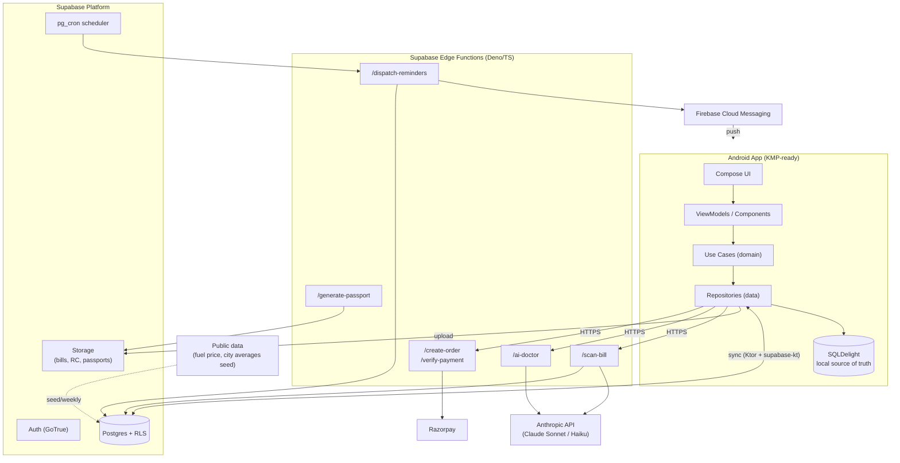
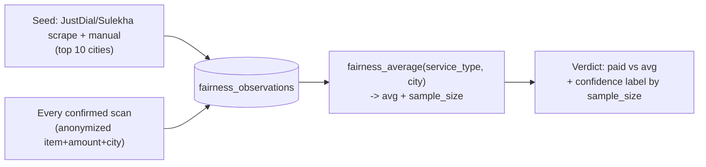
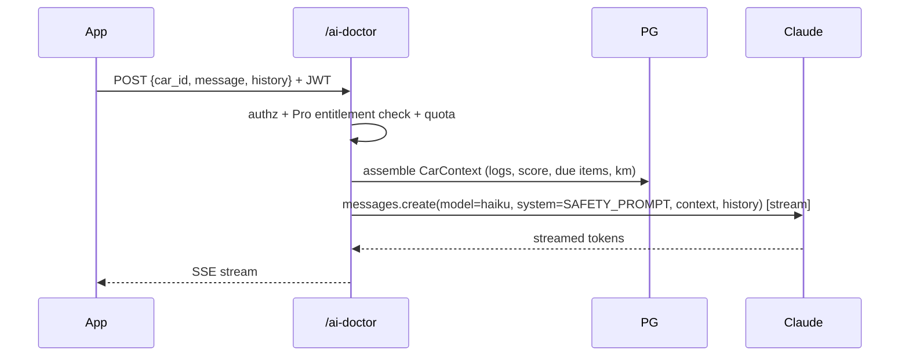
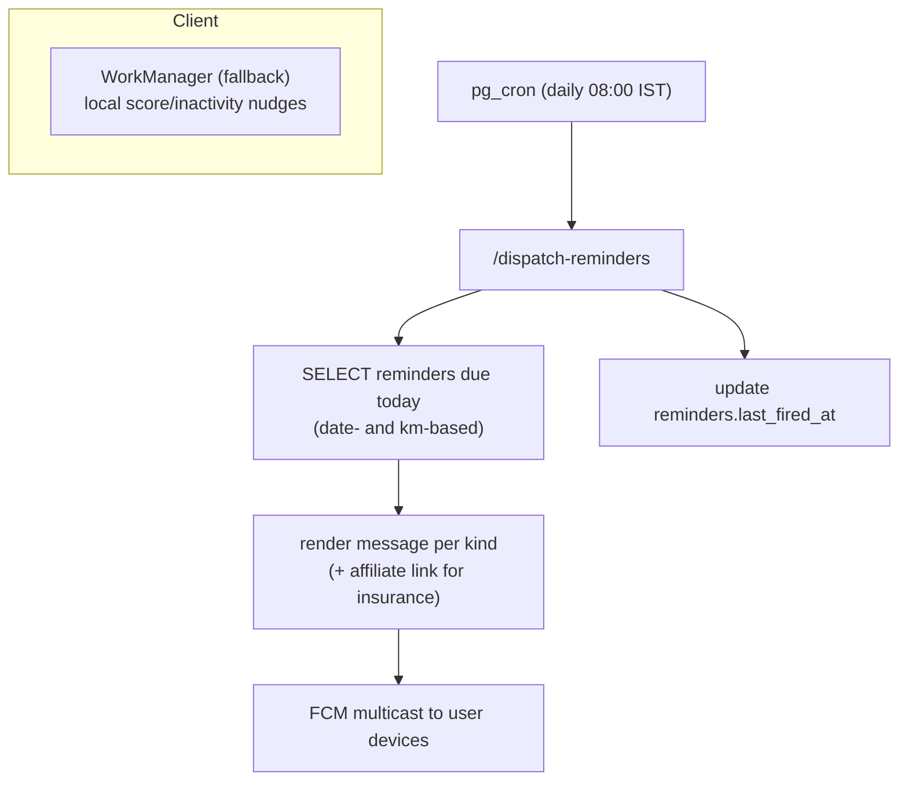
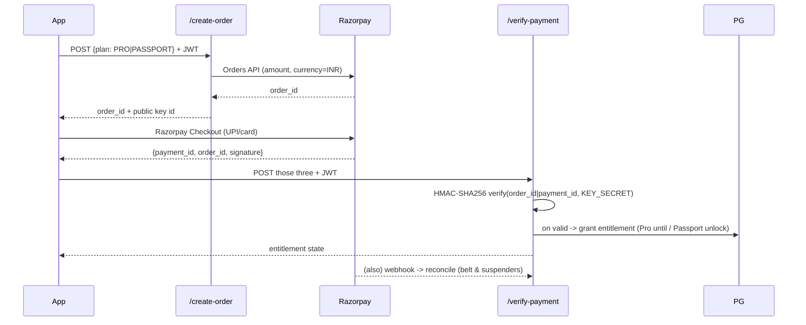

# Odo — Technical Design Document (TDD)

> Engineering companion to `Odo_PRD_v1_0.md`. The PRD answers **what** and **why**; this document answers **how**.

|  |  |
| --- | --- |
| **Version** | v1.0 |
| **Status** | Draft — For Implementation |
| **Scope** | MVP (Month 1–3) with Phase 2/3 forward-compatibility |
| **Platform** | Android first (KMP-ready); iOS in Phase 2 |
| **Owner** | Founder / Lead Engineer |
| **Related docs** | PRD v1.0, DB Schema, AI Prompt Spec (TBD), ADR log |

---

## 1. Purpose & Scope

This document defines the technical architecture, module boundaries, data design, AI subsystem, and operational concerns required to build Odo's MVP. It is written to be directly actionable: interfaces, schemas, prompts, and flows are concrete rather than illustrative.

**In scope (MVP):** Onboarding, Service Log, AI Bill Scanner, Fairness Check, Smart Reminders, rule-based Health Score, Per-km Cost Tracker, account/auth, payments (Razorpay), client-server sync, AI proxy layer.

**Forward-compatible but not built in MVP:** AI Doctor (Phase 2), Resale Passport (Phase 2), Multi-car/Fleet (Phase 2/3). The architecture reserves seams for these so they are additive, not rewrites.

**Out of scope for this doc:** Full DB DDL (separate Schema doc), exhaustive prompt copy (separate AI Prompt Spec), UI visual design (Figma / design system doc).

---

## 2. Architectural Goals & Non-Goals

### 2.1 Goals

1. **Solo-founder velocity.** Ship MVP in ≤ 8 weeks. Favour managed services and boring, well-trodden tech over bespoke infrastructure.
2. **KMP-ready, not KMP-blocked.** All business/domain logic lives in `commonMain` from day one so Phase 2 iOS is a UI exercise, not a re-architecture — but Android UI ships first without waiting on shared UI.
3. **AI as a governed dependency.** No model keys on device, centralized prompt management, hard cost ceilings, graceful degradation when AI is unavailable.
4. **Offline-first.** The app is useful in a parking garage with no signal. Local DB is the source of truth; the cloud is a sync + AI peer.
5. **Trust by construction.** Verified-vs-self-reported distinction, anomaly detection, and anonymization are enforced in the data layer, not bolted on in UI.

### 2.2 Non-Goals

- Microservices, Kubernetes, or any self-managed infra. Supabase + Edge Functions only.
- Real-time multiplayer/collaboration.
- ML model training in MVP (Health Score is deterministic and rule-based by design).
- 99.99% SLA. This is a consumer MVP; best-effort availability is acceptable.

---

## 3. High-Level Architecture



**One-line summary:** A KMP Android client with a local-first SQLDelight store, talking to Supabase for auth/data/storage and to a thin set of Edge Functions that broker every privileged operation (AI calls, payment verification, passport generation, reminder dispatch). The device never holds a secret it shouldn't.

---

## 4. Key Architectural Decisions (ADR Summary)

Each row is a decision that should also exist as a standalone ADR in the repo. Tradeoffs are explicit.

| # | Decision | Chosen | Rejected alternative | Rationale & tradeoff |
| --- | --- | --- | --- | --- |
| 1 | Code-sharing strategy | KMP, all non-UI in `commonMain`; Android UI in `androidMain` | Pure Android (Kotlin/Compose only) | iOS is a committed Phase 2; sharing domain/data now makes it additive. Tradeoff: ~10–15% upfront ceremony (expect/actual, source sets). Acceptable given founder's KMP fluency. |
| 2 | Architecture style | Ports & Adapters (Hexagonal) over Clean/MVVM | Layered MVVM only | Domain depends on nothing; AI/DB/network are swappable adapters behind ports. Enables fakes for the unstable parts (AI). Tradeoff: more interfaces. |
| 3 | AI key custody | Server-side only via Edge Functions | Anthropic SDK in app with key | App-shipped keys are extractable and uncapped. Proxy gives us key safety, per-user rate limits, prompt versioning, and cost ceilings. Tradeoff: one network hop + Edge cold starts. |
| 4 | Local persistence | SQLDelight | Room | KMP-native, type-safe SQL, works in `commonMain`. Tradeoff: less Android-idiomatic tooling than Room. |
| 5 | Source of truth | Local DB (offline-first), cloud is sync peer | Cloud-first (read-through) | Core flows (log a service, view history) must work offline. Tradeoff: must implement sync + conflict handling. |
| 6 | Health Score | Deterministic rule engine in pure Kotlin (domain) | ML model / server-computed | Zero API cost, fully unit-testable, explainable to users ("here's what to fix"). Matches PRD. ML is a Phase 2 upgrade behind the same port. |
| 7 | Navigation | Compose Navigation in `androidMain` for MVP | Decompose in `commonMain` now | MVP velocity. Navigation surface is thin; ViewModels/state are already shared, so a Phase 2 Decompose migration is bounded. Documented as known future work. |
| 8 | DI | Koin | Hilt / manual | KMP support, low ceremony. Tradeoff: runtime (not compile-time) resolution. |
| 9 | Networking | Ktor client + `supabase-kt` | Retrofit | KMP-compatible; `supabase-kt` wraps auth/postgrest/storage/realtime. |
| 10 | Reminder scheduling | Server-side (pg_cron + Edge + FCM), with WorkManager as local fallback | Pure client WorkManager | Device-side alarms are unreliable (Doze, OEM killers, reinstalls). Server scheduling is the trustworthy path for "never miss insurance". Tradeoff: requires backend cron. |
| 11 | Error/result type | Arrow `Either<DomainError, T>` at boundaries | Exceptions everywhere | Explicit, exhaustive error handling for AI/network/payment failure modes. Matches existing project conventions. |

---

## 5. Client Architecture (KMP)

### 5.1 Module structure

```
odo/
├── composeApp/                     # Application module
│   ├── src/androidMain/            # Android entrypoint, Compose host, navigation, platform deps (FCM, Razorpay SDK, CameraX)
│   └── src/commonMain/             # (Phase 2) shared Compose screens
│
├── core/
│   ├── common/                     # Result/Either helpers, dispatchers, time, ids, logging
│   ├── domain/                     # PORTS: entities, value objects, use cases, repository interfaces — depends on NOTHING
│   ├── data/                       # ADAPTERS: repository impls, DTOs, mappers, sync engine
│   ├── database/                   # SQLDelight schema (.sq), drivers (expect/actual)
│   ├── network/                    # Ktor + supabase-kt client, Edge Function clients
│   ├── designsystem/               # tokens, theme, reusable composables (androidMain for MVP)
│   └── analytics/                  # PostHog wrapper behind an AnalyticsPort
│
└── feature/                        # one module per bounded feature; each has its own domain/data/ui slices
    ├── onboarding/
    ├── servicelog/
    ├── billscanner/
    ├── fairness/
    ├── reminders/
    ├── healthscore/
    ├── costtracker/
    ├── aidoctor/        # Phase 2 — stubbed port present in MVP
    └── resalepassport/  # Phase 2 — stubbed port present in MVP
```

**Dependency rule:** `feature → core:domain` always; `feature` never depends on another `feature`. `core:domain` depends on nothing. `core:data`, `core:network`, `core:database` implement `core:domain` ports. The build should enforce this (module visibility / a dependency-analysis Gradle check) so layering violations fail CI, not review.

### 5.2 Layering within a feature

```
presentation (ViewModel/State/Intent)  ──uses──▶  domain (UseCase + Port interfaces)
                                                        ▲
                                              implemented by
                                                        │
                                          data (RepositoryImpl, DTO, Mapper)
```

- **Presentation:** unidirectional MVI-lite. A `StateFlow<UiState>` + `onIntent(Intent)`. ViewModels live in `commonMain` (KMP `ViewModel` via `androidx.lifecycle` KMP artifact or a small `StateScreenModel`), so iOS reuses them.
- **Domain:** entities are immutable data classes; use cases are single-responsibility (`invoke(...)`). Ports are interfaces. No Android/Supabase types leak here.
- **Data:** repository implementations map DTO ⇄ domain, decide local-vs-remote, and own sync.

### 5.3 Representative domain ports

```kotlin
// core:domain — pure Kotlin, no framework imports

@JvmInline value class CarId(val value: String)
@JvmInline value class City(val value: String)

data class Car(
    val id: CarId,
    val make: String,
    val model: String,
    val year: Int,
    val fuel: FuelType,
    val odometerKm: Int,
    val purchaseYear: Int,
    val city: City,
)

sealed interface DomainError {
    data object Offline : DomainError
    data class Validation(val field: String, val reason: String) : DomainError
    data class Unexpected(val cause: String) : DomainError
}

interface CarRepository {
    fun observeCars(): Flow<List<Car>>
    suspend fun get(id: CarId): Car?
    suspend fun upsert(car: Car): Either<DomainError, Car>
}

interface ServiceLogRepository {
    fun observe(carId: CarId): Flow<List<ServiceLog>>
    suspend fun add(entry: ServiceLogDraft): Either<DomainError, ServiceLog>
}

// Bill scanner is a PORT. Its only adapter calls the Edge Function. Tests use a fake.
interface BillScannerPort {
    suspend fun extract(image: ImageRef): Either<ScanError, ExtractedBill>
}

interface FairnessEngine {
    suspend fun assess(items: List<ServiceItem>, city: City): List<FairnessVerdict>
}

// Phase-2 ports defined now, implemented later — keeps MVP additive
interface AiDoctorPort {
    fun converse(ctx: CarContext, history: List<ChatTurn>): Flow<DoctorChunk>
}
interface ResalePassportPort {
    suspend fun generate(carId: CarId): Either<DomainError, PassportRef>
}
```

```kotlin
// Example use case — orchestration only, no I/O details
class ScanAndLogBillUseCase(
    private val scanner: BillScannerPort,
    private val fairness: FairnessEngine,
    private val serviceLogs: ServiceLogRepository,
) {
    suspend operator fun invoke(carId: CarId, image: ImageRef, city: City)
        : Either<ScanError, ScanResult> = either {
        val bill = scanner.extract(image).bind()
        val verdicts = fairness.assess(bill.items, city)
        // Persist as a DRAFT — user confirms before it becomes a verified entry
        ScanResult(bill = bill, fairness = verdicts)
    }
}
```

### 5.4 Health Score — deterministic rule engine

Per PRD, the score is rule-based for MVP: deterministic, free, explainable. It lives entirely in `core:domain` and is the single most heavily unit-tested unit in the codebase.

```kotlin
// core:domain
data class HealthScore(
    val total: Int,                       // 0..100
    val band: Band,
    val breakdown: List<Component>,       // drives the "what to fix" UI
)
enum class Band { EXCELLENT, GOOD, FAIR, POOR }

class HealthScoreCalculator(private val clock: Clock) {
    fun compute(snapshot: CarSnapshot): HealthScore {
        val maintenance = maintenanceRegularity(snapshot)        // 0..35
        val documentation = documentationCompleteness(snapshot)  // 0..30
        val costEfficiency = costEfficiency(snapshot)            // 0..20
        val history = historyCompleteness(snapshot)              // 0..15
        val total = (maintenance + documentation + costEfficiency + history).coerceIn(0, 100)
        return HealthScore(total, bandFor(total), listOf(/* components with deltas & tips */))
    }

    private fun bandFor(t: Int) = when {
        t >= 85 -> Band.EXCELLENT
        t >= 70 -> Band.GOOD
        t >= 50 -> Band.FAIR
        else    -> Band.POOR
    }
    // each sub-score returns points AND the actionable gap, so UI can say "+8 if you upload PUC"
}
```

> **Phase 2 path:** an `MlHealthScorePort` can replace the calculator behind the same consumer interface; the rule engine becomes the fallback/feature-flagged baseline. No call sites change.

---

## 6. Backend Architecture (Supabase)

### 6.1 Components used

| Component | Use |
| --- | --- |
| **Auth (GoTrue)** | Phone OTP (India-first) as primary; email/password fallback. JWT used by RLS. |
| **Postgres + RLS** | Single source of cloud truth. Every user-owned row is RLS-scoped to `auth.uid()`. |
| **Storage** | Three buckets: `bills` (private), `documents` (RC/PUC/insurance, private), `passports` (public-read via signed/short links). |
| **Edge Functions** | All privileged logic: AI proxy, payment verify, passport gen, reminder dispatch. |
| **pg_cron** | Scheduled reminder evaluation and weekly fuel-price refresh. |

### 6.2 Core schema (abridged — full DDL in Schema doc)

```sql
-- Users own cars; cars own logs/documents; logs may reference a bill image.
create table cars (
  id uuid primary key default gen_random_uuid(),
  user_id uuid not null references auth.users(id) on delete cascade,
  make text not null, model text not null, year int not null,
  fuel text not null check (fuel in ('PETROL','DIESEL','CNG','ELECTRIC')),
  odometer_km int not null check (odometer_km >= 0),
  purchase_year int not null,
  city text,
  created_at timestamptz default now(),
  updated_at timestamptz default now()
);

create table service_logs (
  id uuid primary key default gen_random_uuid(),
  car_id uuid not null references cars(id) on delete cascade,
  user_id uuid not null references auth.users(id) on delete cascade,
  serviced_on date not null,
  odometer_km int not null check (odometer_km >= 0),
  workshop_name text,
  total_amount numeric(10,2),
  bill_image_path text,                       -- storage object path; null = self-reported
  verified boolean generated always as (bill_image_path is not null) stored,
  source text not null default 'MANUAL' check (source in ('MANUAL','SCAN')),
  created_at timestamptz default now(),
  updated_at timestamptz default now()
);

create table service_items (
  id uuid primary key default gen_random_uuid(),
  service_log_id uuid not null references service_logs(id) on delete cascade,
  label text not null,                         -- e.g. 'Oil Change'
  amount numeric(10,2) not null
);

-- Anonymized crowdsourcing pool — NO user_id, NO car_id. Only what fairness needs.
create table fairness_observations (
  id uuid primary key default gen_random_uuid(),
  service_type text not null,                  -- normalized label
  city text not null,
  amount numeric(10,2) not null,
  source text not null default 'SCAN',         -- SCAN | SEED
  observed_at timestamptz default now()
);

create table reminders (
  id uuid primary key default gen_random_uuid(),
  user_id uuid not null references auth.users(id) on delete cascade,
  car_id uuid not null references cars(id) on delete cascade,
  kind text not null,                          -- INSURANCE | PUC | SERVICE_KM | SERVICE_TIME | HEALTH_DROP | INACTIVE
  due_on date,                                 -- for date-based kinds
  due_odometer_km int,                         -- for km-based kinds
  last_fired_at timestamptz,
  active boolean default true
);

create table devices ( -- FCM tokens for push
  id uuid primary key default gen_random_uuid(),
  user_id uuid not null references auth.users(id) on delete cascade,
  fcm_token text not null unique,
  platform text not null default 'ANDROID',
  updated_at timestamptz default now()
);

create table ai_usage ( -- cost ceiling enforcement
  id bigserial primary key,
  user_id uuid not null references auth.users(id) on delete cascade,
  feature text not null,                        -- SCAN | DOCTOR
  model text not null,
  input_tokens int, output_tokens int,
  est_cost_inr numeric(10,4),
  created_at timestamptz default now()
);
```

> **Note on schema divergence:** the `DB_SCHEMA.md` document is the authoritative, normalized schema (integer paise, `owner_id` denormalization, enums, lookup tables). The abridged SQL above is illustrative within the TDD; where the two differ, **`DB_SCHEMA.md` wins.**

### 6.3 Row Level Security (illustrative)

```sql
alter table cars enable row level security;
create policy "owner can read"  on cars for select using (auth.uid() = user_id);
create policy "owner can write" on cars for all    using (auth.uid() = user_id)
                                                   with check (auth.uid() = user_id);

-- fairness_observations: clients can INSERT anonymized rows but never SELECT raw rows.
alter table fairness_observations enable row level security;
create policy "no client reads" on fairness_observations for select using (false);
-- Aggregated reads happen via a SECURITY DEFINER function (below), never direct table access.
```

```sql
-- Aggregate access with confidence (count) baked in. No raw rows escape.
create or replace function fairness_average(p_service_type text, p_city text)
returns table(avg_amount numeric, sample_size int)
language sql security definer set search_path = public as $$
  select round(avg(amount),0)::numeric, count(*)::int
  from fairness_observations
  where service_type = p_service_type and city = p_city;
$$;
```

> The `sample_size` is returned to the client *with* the average so the UI can honour the PRD rule: "Based on N data points" and a low-confidence label when `N < 5`. The backend makes false precision structurally impossible.

---

## 7. AI Subsystem Architecture

This is the highest-risk, highest-value subsystem. It is governed centrally.

### 7.1 Why everything goes through Edge Functions

1. **Key custody:** `ANTHROPIC_API_KEY` lives only in Edge Function secrets. It is never compiled into, shipped with, or reachable from the app.
2. **Cost ceiling:** Each call checks `ai_usage` and free-tier limits *before* hitting Anthropic. A runaway client cannot run up the bill (directly addresses the PRD's "AI cost as % of revenue" guardrail and the kill-signal economics).
3. **Prompt versioning:** Prompts live server-side. We can fix a bad prompt or guardrail without an app release — critical for the AI Doctor safety case.
4. **Model swap:** Choosing Sonnet vs Haiku, or upgrading model versions, is a server change.

> **Model note:** PRD specifies `claude-sonnet-4-6` (Bill Scanner) and Claude Haiku (Doctor). Pin exact model strings (e.g. `claude-haiku-4-5`) in Edge config, and re-verify current model IDs and pricing against `docs.claude.com` (or the `claude-api` skill) before launch — model lineups and per-token pricing change, and the unit economics in the PRD depend on it.

### 7.2 Bill Scanner pipeline

```mermaid
sequenceDiagram
    participant App
    participant Storage as Supabase Storage
    participant Edge as /scan-bill
    participant Claude as Anthropic API
    participant PG as Postgres

    App->>Storage: upload bill image (private bucket)
    App->>Edge: POST {storage_path, car_id} + JWT
    Edge->>Edge: authz + free-tier quota check (ai_usage)
    Edge->>Storage: create short signed URL (or read bytes)
    Edge->>Claude: messages.create(model=sonnet, image, tool=extract_bill)
    Claude-->>Edge: tool_use(extract_bill) -> structured JSON
    Edge->>Edge: validate JSON schema + confidence gate
    Edge->>PG: insert anonymized fairness rows (per item)
    Edge->>PG: log ai_usage (tokens, est cost)
    Edge-->>App: {extracted, confidence, fairness[]}
    App->>App: prefill DRAFT log; user confirms (1 tap)
```

**Structured extraction via tool use** (forces well-typed JSON instead of free text):

```json
// tool definition sent to Claude
{
  "name": "extract_bill",
  "description": "Extract structured fields from a vehicle service bill image.",
  "input_schema": {
    "type": "object",
    "properties": {
      "serviced_on": { "type": "string", "description": "ISO date or null if unreadable" },
      "odometer_km": { "type": ["integer","null"] },
      "workshop_name": { "type": ["string","null"] },
      "items": {
        "type": "array",
        "items": {
          "type": "object",
          "properties": {
            "label": { "type": "string" },
            "amount": { "type": "number" }
          },
          "required": ["label","amount"]
        }
      },
      "total_amount": { "type": ["number","null"] },
      "bill_type": { "type": "string", "enum": ["PRINTED_THERMAL","HANDWRITTEN","UNKNOWN"] },
      "extraction_confidence": { "type": "number", "description": "0..1 model self-estimate" }
    },
    "required": ["items","bill_type","extraction_confidence"]
  }
}
```

**Confidence gate (server-side, per PRD honesty rules):**

- `bill_type == HANDWRITTEN` → return result but flag `requires_manual_review = true`; **do not auto-populate**.
- `extraction_confidence < 0.6` → flag low confidence; user must review each field.
- Item label normalization (e.g. "Engine Oil Replacement" → `Oil Change`) happens in the Edge layer against a controlled vocabulary so fairness aggregation is comparable.

### 7.3 Fairness engine



- The flywheel: each confirmed scan contributes anonymized rows, improving averages over time.
- Cold start: seeded data marked `source = 'SEED'`; can be down-weighted later.
- Verdict is never stated as fact when `sample_size < 5` — it degrades to a range with an explicit low-confidence label.

### 7.4 AI Doctor (Phase 2, designed now)



**System prompt skeleton (server-versioned, safety-first):**

```
You are Odo's AI car assistant. You give a FIRST OPINION only — never a
replacement for a mechanic. You are talking to a car owner in India; reply
in their language (Hinglish is fine).

CONTEXT (authoritative — prefer this over guesses):
{car make/model/year}, odometer {km}, last service {date, km, items},
health score {n}, due items {...}.

HARD RULES:
- For ANY safety-critical symptom (brakes, steering, smoke, sudden power loss),
  respond: "Gaadi chalana band karo — turant mechanic ke paas jao." Do not
  speculate further.
- Never claim high accuracy. For diagnosis, give top 3 likely causes and ALWAYS
  recommend a physical inspection.
- Costs are ALWAYS a range, never an exact figure.
- End every reply with a one-line cost range + "mechanic se confirm karo".
```

Guardrails (keyword + classifier) run in the Edge layer *before and after* the model call; safety-critical detection short-circuits to the canned response regardless of model output.

### 7.5 Cost controls (enforced, not hoped for)

| Control | Where | Effect |
| --- | --- | --- |
| Free-tier scan/doctor quotas | Edge, against `ai_usage` | Hard stop → upsell, never silent overspend |
| Per-user daily token budget | Edge | Caps abuse / loops |
| Model routing | Edge | Sonnet only for vision; Haiku for chat |
| Image downscale before send | App + Edge | Fewer vision tokens per scan |
| Idempotency on scan (hash of image) | Edge | Re-scans of same image hit cache, not the API |
| Per-feature cost logging | `ai_usage` | Real-time visibility vs PRD's ~10.7% target |

---

## 8. Data Synchronization & Offline Strategy

> **Superseded by [`SYNC_DESIGN.md`](SYNC_DESIGN.md).** The sketch below is the original
> outline and remains directionally correct; the concrete design — sync columns, the
> `Syncable`/`Synchronizer` seam, outbox push, delta pull, the conflict matrix, sign-in
> adoption, and scheduling — lives there. Where the two differ, **SYNC_DESIGN.md wins.**

**Model:** local-first. Every write hits SQLDelight immediately; the UI reads only from local. A sync engine reconciles with Supabase.

```kotlin
// each syncable row carries:
//   updated_at: Instant         (last local mutation)
//   sync_status: PENDING | SYNCED | CONFLICT
//   remote_version: timestamptz (server updated_at last seen)
```

- **Push:** on connectivity + on app foreground, `PENDING` rows are upserted to Postgres (Ktor/supabase-kt). Success → `SYNCED`.
- **Pull:** delta pull using server `updated_at > last_pull_cursor`.
- **Conflict resolution:** last-write-wins by `updated_at` for MVP (single-user, single-device is the common case). Bill images are immutable once uploaded, so they never conflict. A `CONFLICT` status is reserved for Phase 2 multi-device.
- **Large objects:** images upload to Storage first; rows reference the storage path. Sync moves only metadata.
- **Failure handling:** sync is idempotent (upsert by id). A failed sync leaves `PENDING`; it retries. Nothing is lost offline.

> Reminders are intentionally **not** computed purely client-side (see §10) — the device cannot be trusted to fire "insurance expires tomorrow" reliably. Local WorkManager is a *secondary* nudge, not the system of record.

---

## 9. Notifications & Reminders Architecture



- **Authoritative path:** `pg_cron` triggers `/dispatch-reminders` daily; it queries due reminders, renders per-kind copy (PRD §5.3 lead times: 30/7/1 days etc.), and sends via FCM to the user's `devices`.
- **Km-based reminders** ("service due in 800 km") are evaluated whenever a new odometer reading is logged (DB trigger or sync hook), since they're event-driven, not time-driven.
- **Affiliate links** are injected server-side at render time so partner/commission logic stays out of the client.
- **Local fallback:** WorkManager handles "app inactive 7 days" and immediate "health score dropped" nudges that don't need the server.

---

## 10. Payments Architecture (Razorpay)

Server-verified, never client-trusted.



- Amounts are decided server-side per plan (PRD pricing: Pro ₹149/mo, Passport ₹249 one-time). Client never sends the price.
- Signature verification (`KEY_SECRET` in Edge secrets only) is the gate for entitlement. A spoofed client callback fails HMAC.
- A Razorpay **webhook** also lands on an Edge endpoint to reconcile (handles the "user paid but app closed" case).
- Entitlements stored in a `subscriptions`/`entitlements` table, read by RLS-protected queries; the app gates Pro features off this, with a cached local copy for offline.

---

## 11. Resale Passport (Phase 2, seam reserved)

- Generated **server-side** by `/generate-passport`: assembles car details, full Health Score breakdown, service timeline with Verified/Self-Reported badges, document validity, km-consistency flags, and the honest disclaimer.
- Output: a PDF written to the `passports` bucket + a short-lived signed **web link** (buyer needs no install — PRD requirement).
- Anti-fraud (km anomaly detection) is computed in domain logic and surfaced in the report. "Verified" requires a bill image; the generated artifact cannot fabricate a verified badge because `verified` is a generated column (§6.2).

---

## 12. Security & Privacy Architecture

| Concern | Approach |
| --- | --- |
| AI / payment secrets | Edge Function secrets only; never in app or repo. |
| Auth | Supabase JWT; phone OTP primary. Every privileged Edge call validates the JWT. |
| Data isolation | RLS on every user-owned table, scoped to `auth.uid()`. Default-deny. |
| PII (RC, insurance, bills) | Private Storage buckets; access via short-lived signed URLs only. Encrypted at rest (Supabase default) and in transit (TLS). |
| Crowdsourced fairness data | Stored with **no** user/car linkage; clients cannot read raw rows (RLS `false`); only aggregates via `SECURITY DEFINER` function. |
| Payment integrity | Server-side HMAC signature verification + webhook reconciliation. |
| Data deletion (Play Store requirement) | `on delete cascade` from `auth.users`; a `/delete-account` Edge Function purges Storage objects + DB rows and confirms. |
| Least privilege | App uses anon/JWT-scoped keys only. `service_role` key exists only inside Edge Functions. |
| Logging hygiene | No bill contents, OTPs, or tokens in logs/analytics. |

---

## 13. Analytics & Observability

- **Product analytics:** PostHog behind an `AnalyticsPort` (so it's swappable/mockable and easy to no-op in tests). Event taxonomy mirrors PRD metrics: `bill_scanned`, `overpayment_flagged`, `paywall_shown`, `pro_subscribed`, `reminder_fired`, `passport_generated`. The North Star (`bill_scanned` count) and conversion funnel are first-class.
- **Crash/error:** Android crash reporting (e.g. Crashlytics/Sentry — pick one) + Edge Function structured logs.
- **AI/cost dashboard:** a simple admin query over `ai_usage` to track cost-as-%-of-revenue against the 10.7% target.
- **Privacy:** events carry pseudonymous user ids; no bill content, no PII in event properties.

---

## 14. Testing Strategy

| Layer | What | How |
| --- | --- | --- |
| Domain | Health Score, fairness verdicts, km-anomaly, use cases | Pure unit tests in `commonTest`; this is where the bulk of tests live. Health Score gets exhaustive table-driven tests. |
| Data | Repos, mappers, sync engine | Unit tests with in-memory SQLDelight driver + fake remote. |
| AI ports | `BillScannerPort`, `AiDoctorPort` | Tested via **fakes** returning canned/edge-case payloads (handwritten low-confidence, missing fields). Real API is not in the unit path. |
| Edge Functions | scan/verify/dispatch | Integration tests against a local Supabase + Anthropic mock; HMAC verification has dedicated tests. |
| UI | Critical Compose flows | Compose UI tests for onboarding + scan-confirm happy path. |
| Contract | Bill JSON schema | Schema-validate sample model outputs in CI to catch drift. |

Guiding rule: the unstable dependency (AI) is always behind a port with a fake, so the app is fully testable without spending a paisa on tokens.

---

## 15. CI/CD, Build & Environments

- **VCS/CI:** Bitbucket Pipelines or GitHub Actions — build, ktlint/detekt, unit tests, dependency-layering check, assemble. (Founder already has APK-build automation experience.)
- **Environments:** `dev` and `prod` Supabase projects; Edge secrets per environment; signed release via Play Console internal-testing track first (matches PRD Month 1–2 plan).
- **Config:** no secrets in app; build-time config for Supabase URL/anon key and Razorpay public key id only. Everything sensitive is Edge-side.
- **Release gating:** Play Store Data Safety form + Privacy Policy URL + account-deletion path must be in place before public listing (these block submission otherwise).

---

## 16. Scaling & Cost Notes

- Supabase free/Pro tiers comfortably cover MVP traffic (PRD projects 2.4k users by Month 6). Edge Functions scale per-request; cold starts are acceptable for these flows.
- AI cost is the variable line. With server-side quotas, image downscaling, scan idempotency, and Haiku-for-chat, the architecture is built to hold the PRD's ~10.7%-of-revenue target. The `ai_usage` table makes this measurable from day one.
- First likely bottleneck at scale: fairness aggregation queries — add a materialized view + index on `(service_type, city)` if the fairness pool grows large. Not needed for MVP.

---

## 17. Technical Risks & Mitigations

| Risk | Mitigation |
| --- | --- |
| Vision extraction unreliable on handwritten/thermal bills | Confidence gate; handwritten never auto-populates; user always confirms a draft. |
| AI cost overrun | Hard server quotas + per-user budgets + idempotency; real-time `ai_usage` tracking. |
| Edge cold-start latency on scan | Acceptable (scan is not a tight loop); show progress UI; keep functions small. |
| Sync conflicts as multi-device arrives | MVP is single-device LWW; `CONFLICT` status + version field reserved for Phase 2. |
| Reminder reliability (Doze/OEM killers) | Server-side scheduling via pg_cron + FCM is authoritative; client is only a fallback. |
| Supabase vendor lock-in | Data access sits behind repository ports; Postgres is portable; risk is bounded and accepted for velocity. |
| Prompt regressions break safety (Doctor) | Prompts server-versioned; deterministic guardrails short-circuit safety-critical paths regardless of model output. |

---

## 18. Open Technical Questions

| # | Question | Needed by |
| --- | --- | --- |
| 1 | Controlled vocabulary for service-item normalization — who owns the canonical list? | Before scanner dev |
| 2 | Phone-OTP provider via Supabase in India — cost & deliverability? | Before auth dev |
| 3 | Fuel-price data source for cost tracker — reliable public feed vs manual weekly update? | Before cost tracker |
| 4 | Exact free-tier quota numbers (scans/day, doctor msgs/day) to balance UX vs cost? | Before quota enforcement |
| 5 | Passport web-link hosting — Supabase Storage signed URL vs a tiny static page renderer? | Phase 2 start |
| 6 | Crash/error tool choice (Crashlytics vs Sentry) given privacy stance? | Before public launch |

---

## 19. Appendix — Stack Versions (pin in repo)

| Area | Tech |
| --- | --- |
| Language | Kotlin (KMP) |
| UI | Jetpack Compose (Android); Compose Multiplatform reserved for Phase 2 |
| DI | Koin |
| Persistence | SQLDelight |
| Networking | Ktor client + supabase-kt |
| Errors | Arrow `Either` |
| Backend | Supabase (Postgres, Auth, Storage, Edge Functions, pg_cron) |
| AI | Anthropic API — Sonnet (vision/scan), Haiku (doctor); pin exact model IDs per `docs.claude.com` |
| Push | Firebase Cloud Messaging |
| Payments | Razorpay |
| Analytics | PostHog |
| Camera | CameraX (androidMain) |

---

*Odo TDD v1.0 — Draft for Implementation — Confidential. Pair with PRD v1.0, the DB Schema doc, and the AI Prompt Spec.*
