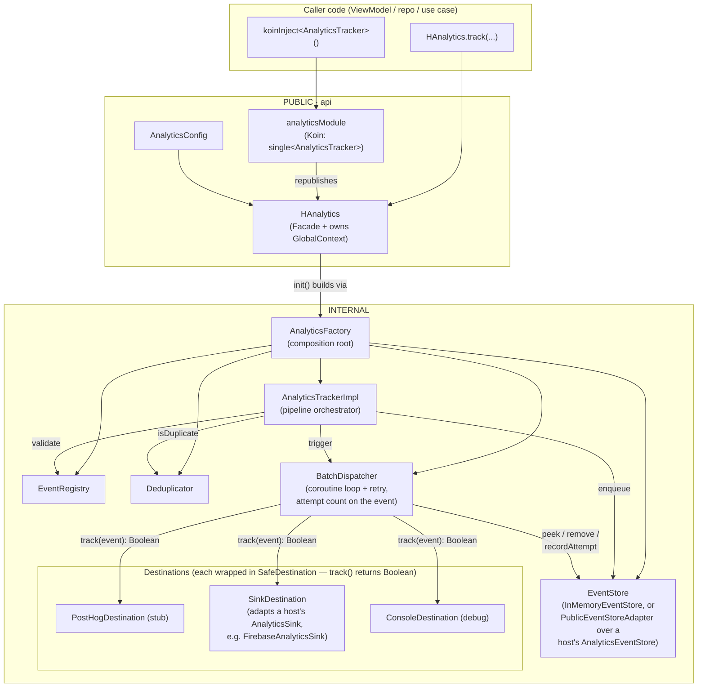
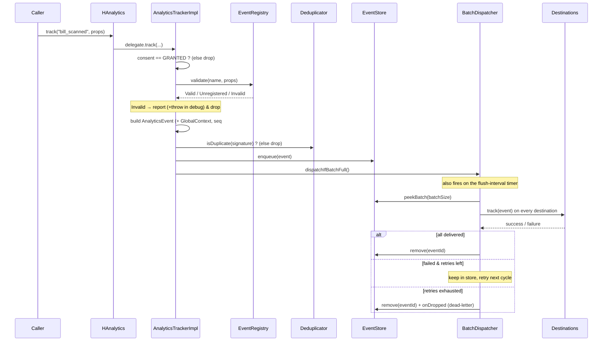
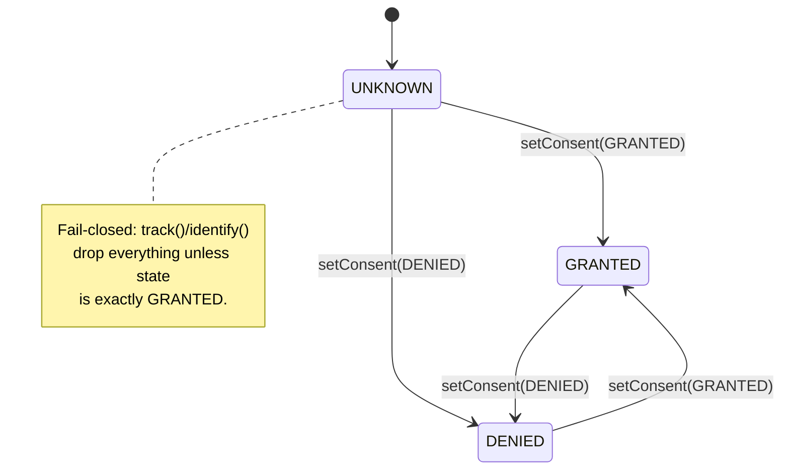
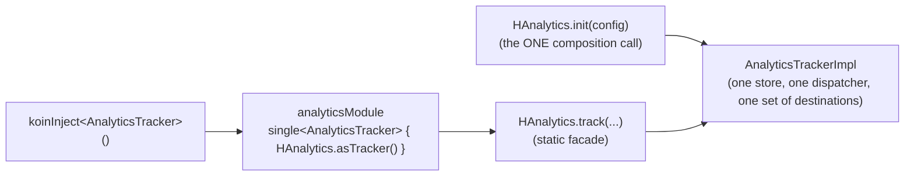

# `:observability:analytics`

> Consent-gated, schema-validated, guaranteed-delivery product analytics for Odo — one small public contract, a hardened internal pipeline, and two interchangeable entry points (Koin DI **and** a static facade) that resolve to the **same** tracker.

| | |
|---|---|
| **Gradle path** | `:observability:analytics` |
| **Package root** | `com.hopcape.analytics` |
| **Targets** | `androidLibrary`, `iosArm64`, `iosSimulatorArm64` (Kotlin Multiplatform, `commonMain` only) |
| **Plugins** | `odo.kmpLibrary`, `odo.koin` |
| **Runtime deps** | `kotlinx-datetime` (timestamps), `kotlinx-coroutines-core` (dispatch loop), `koin-core` (DI binding) |
| **Public entry points** | `Track` / `HAnalytics` (facade) · `analyticsModule` (Koin) · `AnalyticsTracker` (contract) |

> Sibling of [`:observability:logging`](../logging/README.md) — the two observability modules deliberately share shape (`api`/`internal` split, facade + Koin dual entry, fail-safe decorators) so they feel like one system.

---

## Table of contents

1. [Why this module](#1-why-this-module)
2. [Feature summary](#2-feature-summary)
3. [Architecture](#3-architecture)
   - [Package & layer layout](#31-package--layer-layout)
   - [Component diagram](#32-component-diagram)
   - [Track-call sequence](#33-track-call-sequence)
   - [Consent state machine](#34-consent-state-machine)
   - [Design patterns & SOLID map](#35-design-patterns--solid-map)
4. [The two entry points (and why they don't conflict)](#4-the-two-entry-points-and-why-they-dont-conflict)
5. [Getting started](#5-getting-started)
6. [Public API reference](#6-public-api-reference)
7. [Usage cookbook](#7-usage-cookbook)
8. [Event schema & validation](#8-event-schema--validation)
9. [Consent & privacy](#9-consent--privacy)
10. [The delivery pipeline (batching, retry, dedup)](#10-the-delivery-pipeline-batching-retry-dedup)
11. [Concurrency & failure-safety guarantees](#11-concurrency--failure-safety-guarantees)
12. [Extending the pipeline](#12-extending-the-pipeline)
13. [Visibility policy](#13-visibility-policy)
14. [Testing](#14-testing)
15. [Internal component reference](#15-internal-component-reference)
16. [Known limitations & roadmap](#16-known-limitations--roadmap)
17. [FAQ](#17-faq)

---

## 1. Why this module

Product code (ViewModels, repositories, use cases) needs to record behavioural events without:

- knowing **where** events go (PostHog, Firebase, a warehouse…),
- hand-rolling **consent** checks at every call site (a compliance landmine),
- being able to **crash** because a vendor SDK threw,
- losing events when the app is **offline** or is killed mid-flush,
- coupling to any platform, so the same code runs on iOS.

This module gives callers a **four-method contract** (`AnalyticsTracker`) plus an ergonomic **facade** (`HAnalytics`), and hides everything else (destinations, batching, retry, dedup, schema validation) behind `internal` visibility. Swapping vendors or tuning batching is a change in **one** composition root — never at a call site.

The North Star metric is **bills scanned / month**, so getting event delivery *correct and durable* matters more than raw throughput.

---

## 2. Feature summary

- **Consent-gated (fail-closed)** — nothing is tracked until consent is `GRANTED`. GDPR / India DPDP friendly by construction.
- **Schema validation** — events are type-checked against a registered [`EventSchema`](#8-event-schema--validation); typos and wrong types are caught in debug, unknown events pass through in production so field data is never silently lost.
- **Guaranteed delivery** — events are queued in a durable-by-design store and delivered by a batching dispatcher with retry + dead-lettering. Not "best effort" like the logger.
- **Multi-destination fan-out** — one event goes to N vendor SDKs (PostHog, Firebase, …) via the Strategy pattern.
- **Crash-proof** — a misbehaving vendor SDK can never throw into caller code or block the other destinations (`SafeDestination`).
- **Automatic context** — app version, device, OS, locale, session id, anonymous/user id are attached to every event without call sites repeating them.
- **Double-fire dedup** — a double-tapped "Buy Now" fires `purchase_completed` once, not twice.
- **Two access styles, one tracker** — inject `AnalyticsTracker` via Koin **or** call `HAnalytics` statically; both share the same configured pipeline.
- **KMP-native** — pure `commonMain`; no `expect/actual`, no `java.util.concurrent`. Compiles unchanged for Android and iOS.

---

## 3. Architecture

### 3.1 Package & layer layout

The package name encodes the visibility contract: **`api` = public surface, `internal` = implementation.**

```
com.hopcape.analytics
├── api/                         ← PUBLIC. The only things callers may import.
│   ├── AnalyticsTracker.kt          interface AnalyticsTracker  (the contract, ISP)
│   ├── AnalyticsConfig.kt           data class + defaults        (startup config)
│   ├── AnalyticsSink.kt             interface AnalyticsSink       (extra-destination port)
│   ├── AnalyticsEventStore.kt       interface + StoredAnalyticsEvent/Context (durable-queue port)
│   ├── HAnalytics.kt                object HAnalytics            (the Facade)
│   ├── AnalyticsModule.kt           val analyticsModule          (Koin binding)
│   ├── ConsentStatus.kt             enum UNKNOWN/GRANTED/DENIED
│   ├── UserTraits.kt                data class (identify payload)
│   └── EventSchema.kt               data class EventSchema + enum PropertyType
│
└── internal/                    ← INTERNAL. Not visible outside this module.
    ├── AnalyticsFactory.kt          composition root: wires the pipeline (Factory)
    ├── AnalyticsTrackerImpl.kt      orchestrates consent→validate→dedup→enqueue (SRP)
    ├── model/
    │   ├── AnalyticsEvent.kt         immutable, fully-resolved event (carries attemptCount)
    │   └── GlobalContext.kt          auto-attached "super properties"
    ├── validation/
    │   ├── EventRegistry.kt          immutable schema lookup + validation
    │   └── SchemaValidationResult.kt Valid / Unregistered / Invalid
    ├── dedup/
    │   └── Deduplicator.kt           bounded, lock-free double-fire guard
    ├── store/
    │   ├── EventStore.kt             persistence abstraction (DIP)
    │   ├── InMemoryEventStore.kt     lock-free copy-on-write default
    │   └── PublicEventStoreAdapter.kt bridges a host's AnalyticsEventStore into EventStore
    ├── dispatch/
    │   ├── BatchDispatcher.kt        coroutine batch/retry engine
    │   └── RetryPolicy.kt            exponential backoff bounds
    └── destinations/
        ├── AnalyticsDestination.kt   interface (Strategy) — track() returns Boolean (delivered?)
        ├── SafeDestination.kt        exception-swallowing decorator (Decorator)
        ├── SinkDestination.kt        adapts a host's AnalyticsSink into AnalyticsDestination
        ├── PostHogDestination.kt     primary vendor adapter (stub)
        └── ConsoleDestination.kt     debug-only echo destination
```

**Dependency rule:** `internal` may depend on `api` (a destination references `UserTraits`); `api` never depends on concrete `internal` types except at the two composition roots (`HAnalytics`, `AnalyticsFactory`) — which is the whole point of a composition root.

**Firebase moved out.** What was `FirebaseDestination` here is now `FirebaseAnalyticsSink` in `:infrastructure:firebase:analytics`, registered via `AnalyticsConfig.destinations` — this module has no Firebase dependency at all. See that module for the sanitizer, the consent-gate decision, and the iOS bootstrap notes.

### 3.2 Component diagram



Each destination is wrapped: `SafeDestination( <real vendor adapter> )` — the inner adapter ships the event and reports whether it was accepted, the wrapper guarantees a throw can never reach the dispatcher (it becomes `false` — a failed delivery — instead).

### 3.3 Track-call sequence

What happens on `HAnalytics.track("bill_scanned", mapOf("odometer" to 45210))`:



### 3.4 Consent state machine



### 3.5 Design patterns & SOLID map

| Pattern / principle | Where | Payoff |
|---|---|---|
| **Facade** | `HAnalytics` | One import for 95% of call sites; hides init/config/context. |
| **Factory + composition root** | `AnalyticsFactory.create(config)` | The single place that names concrete destinations/store/dispatcher. |
| **Strategy** | `AnalyticsDestination` + `PostHog`/`Firebase`/`Console` | Add a vendor = new class, zero edits elsewhere (OCP). |
| **Decorator** | `SafeDestination` | Add crash-safety by wrapping, not modifying, a destination. |
| **Adapter (router)** | `HAnalytics.DelegatingTracker` | Stable DI reference that reads the live delegate. |
| **ISP** | `AnalyticsTracker` is four methods | Callers depend on the minimum. |
| **DIP** | callers → `AnalyticsTracker`; dispatcher → `EventStore`/`AnalyticsDestination` | Nothing depends on a concrete vendor or store. |
| **SRP** | orchestrator sequences; registry validates; dispatcher delivers; dedup dedups | Small, independently testable units. |
| **LSP** | `NoOpTracker`, `DelegatingTracker`, `AnalyticsTrackerImpl` all *are* `AnalyticsTracker` | Substitutable everywhere a tracker is expected. |

---

## 4. The two entry points (and why they don't conflict)

There are two ways to obtain a tracker, and they intentionally resolve to **one** underlying pipeline:



- **`HAnalytics` (facade)** — global, ergonomic, no injection. Owns the mutable `GlobalContext` (session id, user id) and enriches events with it. Ideal for leaf/utility code and bootstraps.
- **`analyticsModule` (Koin)** — binds `single<AnalyticsTracker> { HAnalytics.asTracker() }`. Ideal for constructor-injected classes that want the port for testability.

Because `analyticsModule` **republishes** `HAnalytics.asTracker()` rather than building its own tracker, there is exactly **one** config, **one** dispatch queue, and **one** set of destinations — no duplicate delivery. Configuration therefore lives in a single `HAnalytics.init(...)` call at startup.

> **Ordering:** call `HAnalytics.init(...)` before the Koin graph is *used*. `asTracker()` returns a stable reference that reads the live delegate at call time, so strict ordering isn't required for correctness — initializing first just means the very first injected `track` already hits the real pipeline.

---

## 5. Getting started

### 5.1 Add the dependency

```kotlin
// consumer module build.gradle.kts
dependencies {
    implementation(projects.observability.analytics)
}
```

List `analyticsModule` in your `startKoin { modules(...) }` (Odo does this in `initKoin`).

### 5.2 Initialize once at startup

**Android** (`OdoApplication.onCreate`):

```kotlin
HAnalytics.init(
    AnalyticsConfig(
        appVersion = BuildConfig.VERSION_NAME,
        deviceModel = Build.MODEL,
        osVersion = "Android ${Build.VERSION.RELEASE}",
        locale = Locale.getDefault().toLanguageTag(),
        isDebug = BuildConfig.DEBUG,
        events = OdoEvents.schemas,                 // your taxonomy — see §8
        onDiagnostic = { HLogger.tag("Analytics").w(it) },
    )
)
```

**iOS** (`MainViewController`):

```kotlin
HAnalytics.init(
    AnalyticsConfig(
        appVersion = appVersion,
        deviceModel = deviceModel,
        osVersion = osVersion,
        locale = locale,
        isDebug = Platform.isDebugBinary,
        events = OdoEvents.schemas,
    )
)
```

### 5.3 Grant consent, then track

```kotlin
Track.setConsent(ConsentStatus.GRANTED)   // after the consent screen
Track.track("bill_scanned", mapOf("odometer" to 45210, "workshop" to "auto-care"))
```

> `Track` is the brandable alias for `HAnalytics` — use whichever reads best; they are the same object.

That's the entire wiring. Everything below is call-site usage.

---

## 6. Public API reference

Only these types are importable from outside the module. Everything else is `internal`.

### `interface AnalyticsTracker`
The core contract — the port every caller depends on.

```kotlin
fun identify(traits: UserTraits)
fun track(eventName: String, properties: Map<String, Any?> = emptyMap())
fun setConsent(status: ConsentStatus)
fun flush()
```

### `object HAnalytics` — the facade  ·  `typealias Track = HAnalytics`
`Track` is the brandable, preferred call-site name — it *is* `HAnalytics` (same object), so `Track.track(...)` and `HAnalytics.track(...)` are identical.
```kotlin
fun init(config: AnalyticsConfig)                 // idempotent; safe to call twice (no-op + diagnostic)
fun setSession(sessionId: String)                 // process-wide session id (e.g. per app-open)
fun identify(userId: String, traits: Map<String, Any?> = emptyMap())
fun setConsent(status: ConsentStatus)
fun track(eventName: String, properties: Map<String, Any?> = emptyMap())
fun flush()
fun asTracker(): AnalyticsTracker                 // the plain tracker for DI (what analyticsModule binds)
```

### `data class AnalyticsConfig`
Immutable startup configuration. See [§5](#5-getting-started). Fields:

| Field | Type | Default | Effect |
|---|---|---|---|
| `appVersion` / `deviceModel` / `osVersion` / `locale` | `String` | *(required)* | Stamped onto every event's context. |
| `isDebug` | `Boolean` | `false` | Debug: strict schema validation + a `ConsoleDestination`. Production: lenient. |
| `events` | `List<EventSchema>` | `emptyList()` | The event taxonomy validated against. |
| `batchSize` | `Int` | `20` | Deliver once this many events are queued (size trigger). |
| `flushInterval` | `Duration` | `10.seconds` | Deliver at least this often (time trigger). |
| `destinations` | `List<AnalyticsSink>` | `emptyList()` | Extra vendor destinations from outside this module (e.g. Firebase). Each wrapped in `SafeDestination` like the built-ins. |
| `eventStore` | `(() -> AnalyticsEventStore)?` | `null` | A durable queue provider, resolved lazily on first use. `null` keeps the in-memory default — buffered events do not survive process death. |
| `onDiagnostic` | `(String) -> Unit` | `{}` | Module self-diagnostics (dupes, drops, violations, storage failures). Wire to your logger. |

### `val analyticsModule: Module`
Koin module binding `single<AnalyticsTracker> { HAnalytics.asTracker() }`.

### `enum ConsentStatus`
`UNKNOWN` · `GRANTED` · `DENIED`. Tracking flows only while `GRANTED` (fail-closed).

### `data class UserTraits`
```kotlin
UserTraits(userId: String, traits: Map<String, Any?> = emptyMap())
```

### `data class EventSchema` + `enum PropertyType`
```kotlin
EventSchema(eventName: String, requiredProperties: Map<String, PropertyType> = emptyMap())
enum PropertyType { STRING, INT, LONG, DOUBLE, BOOLEAN, NUMBER, ANY }
```

### `interface AnalyticsSink`
The port an outside module implements to add a vendor destination without this module depending on that vendor's SDK (e.g. `FirebaseAnalyticsSink` in `:infrastructure:firebase:analytics`). Registered via `AnalyticsConfig.destinations`.
```kotlin
val name: String
fun identify(traits: UserTraits)
fun track(eventName: String, properties: Map<String, Any?>, timestampMs: Long): Boolean  // delivered?
fun flush()
```
`AnalyticsTracker.track()` itself is unchanged and stays `Unit` — callers never see a delivery result. The `Boolean` is purely between a sink and the dispatcher: `true` removes the event from the queue, `false` retries it. A sink also returns `true` for an event it has permanently rejected (e.g. an invalid name) — retrying can't fix that, so treating it as handled (not retried) is the correct call, the same distinction the sync engine draws between a transient failure and a permanent one.

### `interface AnalyticsEventStore` + `data class StoredAnalyticsEvent` / `StoredAnalyticsContext`
The port an outside module implements to back the queue with real storage. Suspend, matching every other local-write port in the app — a durable implementation's own I/O runs on whatever dispatcher its caller provides.
```kotlin
suspend fun enqueue(event: StoredAnalyticsEvent)
suspend fun peekBatch(maxSize: Int): List<StoredAnalyticsEvent>
suspend fun remove(eventIds: List<String>)
suspend fun size(): Int
suspend fun recordAttempt(eventId: String, attempt: Int)   // persists a failed delivery's retry count
```
No size/age limit in the contract — enforcing one is the implementation's job (e.g. `SqlDelightAnalyticsEventStore` in `:infrastructure:database` caps at 1000 rows / 7 days). The port only promises FIFO ordering and durability. `StoredAnalyticsEvent`/`StoredAnalyticsContext` mirror the internal event model field-for-field, kept as separate public types so a store never has to see internal pipeline types.

---

## 7. Usage cookbook

### 7.1 Inject the `AnalyticsTracker` port (Koin)

```kotlin
class BillScannerViewModel(
    private val analytics: AnalyticsTracker,        // resolved from analyticsModule
) {
    fun onBillScanned(odometer: Int, workshop: String) {
        analytics.track("bill_scanned", mapOf("odometer" to odometer, "workshop" to workshop))
    }
}

// DI registration
val billScannerModule = module {
    viewModel { BillScannerViewModel(analytics = get()) }
}
```

### 7.2 Static facade (no injection)

```kotlin
Track.track("app_opened", mapOf("coldStart" to true))
```

### 7.3 Identify a user after login

```kotlin
HAnalytics.setSession(sessionId = session.id)
HAnalytics.identify(userId = user.id, traits = mapOf("city" to "Mumbai", "plan" to "pro"))
```

### 7.4 Consent lifecycle

```kotlin
// On the consent screen:
HAnalytics.setConsent(if (userOptedIn) ConsentStatus.GRANTED else ConsentStatus.DENIED)
```

### 7.5 Force a flush (before a crash handler / process exit)

```kotlin
HAnalytics.flush()
```

---

## 8. Event schema & validation

Declare your taxonomy once and pass it via `AnalyticsConfig.events`. Registered events are type-checked; the check is expressed with the KMP-safe `PropertyType` enum (no JVM reflection), so it runs identically on iOS.

```kotlin
object OdoEvents {
    val schemas = listOf(
        EventSchema(
            eventName = "bill_scanned",
            requiredProperties = mapOf(
                "odometer" to PropertyType.INT,     // odometer is mandatory & first-class in Odo
                "workshop" to PropertyType.STRING,
            ),
        ),
        EventSchema("app_opened", mapOf("coldStart" to PropertyType.BOOLEAN)),
        EventSchema("reminder_tapped", mapOf("type" to PropertyType.STRING)),
    )
}
```

**Validation policy** (`AnalyticsTrackerImpl`):

| Registry result | Debug (`isDebug = true`) | Production (`isDebug = false`) |
|---|---|---|
| **Valid** | delivered | delivered |
| **Invalid** (missing/wrong-typed property) | `onDiagnostic` **+ throws** (fail fast) | `onDiagnostic` + dropped |
| **Unregistered** (no schema) | `onDiagnostic` + dropped (enforce discipline) | **delivered** (never lose field data) |

So an empty `events` list means "no enforcement" — everything is treated as `Unregistered` and, in production, passes through. Tighten incrementally by registering schemas.

---

## 9. Consent & privacy

- **Fail-closed gate.** `track` and `identify` are dropped unless consent is exactly `GRANTED`. The default state is `UNKNOWN` — so nothing leaks before the user has decided.
- **Set it early.** Call `setConsent` from your consent screen; wire it to remote/stored preference on next launch.
- **On `DENIED`** the gate stops all new events immediately, but does not purge whatever is already queued — see [roadmap](#16-known-limitations--roadmap). That's a different lever from sign-out: Odo's own `AnalyticsEventStore` implementation is cleared as part of the sign-out wipe (queued events carry the outgoing user's id), independent of this module's consent state.
- Context carries an `anonymousId` (random per install) and, only after `identify`, a `userId`.

---

## 10. The delivery pipeline (batching, retry, dedup)

Unlike the logger's "best effort" sinks, analytics **guarantees delivery**:

- **Store first.** Every accepted event is `enqueue`d into an `EventStore` *before* any delivery attempt. The store is the source of truth. The default is in-memory (does not survive process death — fine for tests and hosts that haven't wired one); passing `AnalyticsConfig.eventStore` swaps in a durable, host-provided queue via `PublicEventStoreAdapter`. Odo's own bootstrap does this with a SQLDelight-backed store in `:infrastructure:database` (`analytics_events`, capped at 1000 rows / 7 days).
- **Two flush triggers**, plus an explicit one. `BatchDispatcher` delivers when the queue reaches `batchSize` (size trigger) **or** every `flushInterval` (time trigger, a coroutine loop on `Dispatchers.Default`). A host also calls `HAnalytics.flush()` on app launch and on every foreground, so a durable queue drains promptly rather than waiting out the timer.
- **All-or-nothing per event.** An event is removed from the store only once **every** destination's `track()` returns `true`.
- **Retry + dead-letter, durably.** A failed event's attempt count lives on the event itself (`AnalyticsEvent.attemptCount`), persisted via `EventStore.recordAttempt` rather than kept in a side map — a durable store makes dead-lettering survive a process restart instead of resetting the count every launch. `RetryPolicy` bounds attempts (default 6); once exhausted the event is dead-lettered (`onDropped`) and removed so it can't wedge the queue.
- **Dedup.** `Deduplicator` collapses accidental double-fires within a bounded recency window, keyed on a content signature (event name + sorted properties). In-memory only — this guard is about a double-tapped button, not something a durable store needs to know about.

---

## 11. Concurrency & failure-safety guarantees

- **Tracking never crashes callers.** Every destination is wrapped in `SafeDestination`, which `try/catch`es and swallows any `Throwable`. A dead vendor SDK degrades analytics, never the app — and never blocks the other destinations.
- **Pre-init safety.** Before `HAnalytics.init`, the delegate is a `NoOpTracker`; calls are silently dropped, never `NPE`.
- **Idempotent init.** `init()` is guarded by an `AtomicBoolean` CAS — a duplicate call (test setup, multi-process) is a no-op + diagnostic, not a re-wire.
- **KMP-native concurrency, no `java.util.concurrent`.**
  - The dispatch timer is a **coroutine** loop, not a `ScheduledExecutorService`.
  - The dispatch critical section is serialized by a coroutine `Mutex`.
  - `InMemoryEventStore` and `Deduplicator` are **lock-free copy-on-write** structures behind an `AtomicReference` with a CAS retry loop — correct under concurrent producer (caller thread) / consumer (dispatch coroutine) access.
  - `PublicEventStoreAdapter` (a durable store) is asymmetric on purpose: `enqueue()`/`size()` never block the calling thread (fire-and-forget onto a shared `CoroutineScope`, and a local `AtomicInt` counter respectively), because `track()` is a public, synchronous, fire-and-forget call often made from the UI thread, and a durable store's first resolution can mean building a database. `peekBatch()`/`remove()`/`recordAttempt()` block instead — every caller is already `BatchDispatcher`'s own background coroutine, never the UI thread, so a bounded wait for a suspend call is the honest, simple choice over a second dispatch mechanism.
  - `GlobalContext` and the `delegate` are `@Volatile`, so an `init()`/`setSession()` on one thread is visible to trackers on others.
  - `consent` is an `AtomicReference<ConsentStatus>` — the gate reads a consistent value.

---

## 12. Extending the pipeline

**Add a new destination, from outside this module (the common case — e.g. Firebase, a warehouse endpoint):**

Implement `AnalyticsSink` and pass it via `AnalyticsConfig.destinations`. No changes to this module at all:
```kotlin
class AmplitudeSink : AnalyticsSink {
    override val name = "amplitude"
    override fun identify(traits: UserTraits) { /* Amplitude.setUserId(...) */ }
    override fun track(eventName: String, properties: Map<String, Any?>, timestampMs: Long): Boolean {
        return runCatching { Amplitude.logEvent(eventName, properties) }.isSuccess
    }
    override fun flush() { /* Amplitude.flush() */ }
}
// HAnalytics.init(AnalyticsConfig(..., destinations = listOf(AmplitudeSink())))
```
This is exactly how `:infrastructure:firebase:analytics`'s `FirebaseAnalyticsSink` is wired — see that module for a fuller example, including a sanitizer that normalizes values before handing them to the vendor SDK.

**Add a built-in destination this module owns (rare — only for a vendor the module ships with, like PostHog):**

1. Implement `AnalyticsDestination` in `internal/destinations/` (SRP — one vendor):
   ```kotlin
   internal class AmplitudeDestination : AnalyticsDestination {
       override val name = "amplitude"
       override fun identify(traits: UserTraits) { /* Amplitude.setUserId(...) */ }
       override fun track(event: AnalyticsEvent): Boolean {
           /* Amplitude.logEvent(...) */
           return true // did the vendor SDK accept it?
       }
       override fun flush() { /* Amplitude.flush() */ }
   }
   ```
2. Add it to the `buildList` in `AnalyticsFactory.create(config)`. It is automatically wrapped in `SafeDestination` like the others.

No changes to the dispatcher, orchestrator, or any call site — that's OCP + Decorator paying off.

**Add a new property type:** extend `PropertyType` and its `matches` `when`.

**Back the store with persistence:** implement `AnalyticsEventStore` and pass a provider via `AnalyticsConfig.eventStore`. Already done — see `SqlDelightAnalyticsEventStore` in `:infrastructure:database`.

---

## 13. Visibility policy

The rule is mechanical and enforced by package:

- **`com.hopcape.analytics.api.*` → `public`** — the supported surface: `AnalyticsTracker`, `AnalyticsSink`, `AnalyticsEventStore` (+ `StoredAnalyticsEvent`/`StoredAnalyticsContext`), `HAnalytics`, `AnalyticsConfig`, `analyticsModule`, `ConsentStatus`, `UserTraits`, `EventSchema` (+ `PropertyType`).
- **`com.hopcape.analytics.internal.*` → `internal`** — every implementation type (`AnalyticsFactory`, `AnalyticsTrackerImpl`, all destinations, store, dispatcher, dedup, registry, models). None are importable by consumers.

If you need to expose a new capability, put its stable type in `api`; keep the machinery in `internal`.

---

## 14. Testing

The `AnalyticsTracker` port makes consumers trivially testable — no real vendors, no network:

```kotlin
class RecordingTracker : AnalyticsTracker {
    val events = mutableListOf<Pair<String, Map<String, Any?>>>()
    override fun track(eventName: String, properties: Map<String, Any?>) {
        events += eventName to properties
    }
    override fun identify(traits: UserTraits) {}
    override fun setConsent(status: ConsentStatus) {}
    override fun flush() {}
}

@Test
fun vm_tracks_on_scan() {
    val analytics = RecordingTracker()
    BillScannerViewModel(analytics).onBillScanned(odometer = 45210, workshop = "auto-care")
    assertEquals("bill_scanned", analytics.events.single().first)
}
```

`ConsoleDestination` takes an injectable `sink`, so pipeline behaviour (consent gating, validation, dedup) can be asserted against captured strings without a real SDK. For code that calls `HAnalytics` statically, prefer passing `HAnalytics.asTracker()` (or a fake) behind an `AnalyticsTracker` parameter so you don't touch global state.

---

## 15. Internal component reference

| Component | Responsibility |
|---|---|
| `AnalyticsFactory` | Composition root: assembles registry, destinations (each `SafeDestination`-wrapped), store (in-memory or a `PublicEventStoreAdapter`), dispatcher, and the orchestrator from an `AnalyticsConfig`. |
| `AnalyticsTrackerImpl` | Sequences the pipeline: consent gate → validate → build event → dedup → enqueue → trigger dispatch. Nothing else. |
| `AnalyticsEvent` / `GlobalContext` | Immutable event + auto-attached super-properties (`kotlinx-datetime` timestamp, `Uuid` ids, retry `attemptCount`). |
| `EventRegistry` | Immutable schema lookup; returns `Valid`/`Unregistered`/`Invalid`. |
| `Deduplicator` | Bounded, lock-free copy-on-write double-fire guard keyed on a content signature. |
| `EventStore` / `InMemoryEventStore` | Internal queue abstraction (sync) + a lock-free in-memory default that does not survive process death. |
| `PublicEventStoreAdapter` | Bridges a host's suspend `AnalyticsEventStore` into the internal sync `EventStore` — fire-and-forget writes, blocking reads (always from the dispatcher's own background coroutine), and a local counter so `size()` never touches the store. |
| `BatchDispatcher` | Coroutine batch/retry engine; size + time triggers, retry, durable dead-lettering (attempt count persisted via the store), sequence numbers. |
| `RetryPolicy` | Exponential-backoff bounds + give-up decision. |
| `AnalyticsDestination` | Strategy interface — one per vendor SDK; `track()` returns whether the event was accepted. |
| `SafeDestination` | Decorator — catches a throw and reports it, turning it into a `false` (failed delivery) rather than letting it reach the dispatcher. |
| `SinkDestination` | Adapter from the public `AnalyticsSink` to the internal `AnalyticsDestination` shape. |
| `PostHogDestination` / `ConsoleDestination` | Concrete built-in adapters (PostHog primary — stub; Console debug-only). Firebase is no longer built in — see `:infrastructure:firebase:analytics`. |

---

## 16. Known limitations & roadmap

Current state is honest about what's stubbed:

- **PostHog is a stub.** `PostHogDestination` sketches the real SDK calls in comments but is a no-op until the SDK is wired — it reports success unconditionally for now, on purpose, so a stubbed destination can't fill the durable queue with events it will never actually send. Delivery, batching, retry, and dedup around it are real. Firebase is real (`:infrastructure:firebase:analytics`).
- **`RetryPolicy.delayForAttempt` isn't wired into scheduling yet.** Retries currently ride the fixed `flushInterval` rather than per-attempt backoff; the policy is present and used for `shouldGiveUp`.
- **`setConsent(DENIED)` doesn't purge the queue yet.** It stops new events; a full implementation also clears queued events and disables vendor collection. (Sign-out is a separate, already-solved case — see §9.)
- **No per-destination filtering.** Every event goes to every destination; add per-destination allow/deny lists if a vendor should see a subset.
- **A durable store's row/age caps are the implementation's job, not this module's.** `AnalyticsEventStore` promises FIFO + durability only; if you write a second implementation, remember to cap it yourself (see `SqlDelightAnalyticsEventStore`'s row/age eviction for the shape).

None of these affect the public API — they are internal upgrades behind the existing contract.

---

## 17. FAQ

**Q: Should I inject `AnalyticsTracker` or call `HAnalytics`?**
Inject `AnalyticsTracker` in classes that already use DI (ViewModels, repositories) — it keeps them unit-testable. Use `HAnalytics` in leaf/utility code and bootstraps. Both hit the same pipeline. Note the facade's `identify(userId, traits)` also enriches the global context; the injected port's `identify(UserTraits)` only forwards to destinations.

**Q: My events aren't showing up.**
Check consent — nothing is tracked unless `setConsent(GRANTED)` was called. In debug, an unregistered event is dropped (register a schema or add it to `events`). Wire `onDiagnostic` to see exactly why.

**Q: Why is delivery "guaranteed" here but logging is "best effort"?**
Analytics drives product decisions and the North Star metric, so events are queued in a store and retried until delivered or dead-lettered. Logs are diagnostic and cheap to lose, so the logger just fans out synchronously.

**Q: Is it safe to track from many threads?**
Yes — the delegate and context are `@Volatile`, destinations are exception-isolated, the store/dedup are lock-free CAS structures, and the dispatch critical section is `Mutex`-serialized.

**Q: Why no `java.util.concurrent` / `ScheduledExecutorService`?**
This is a `commonMain` KMP module targeting Android **and** iOS. It uses coroutines + `kotlin.concurrent.atomics` so the exact same code compiles for both platforms.
